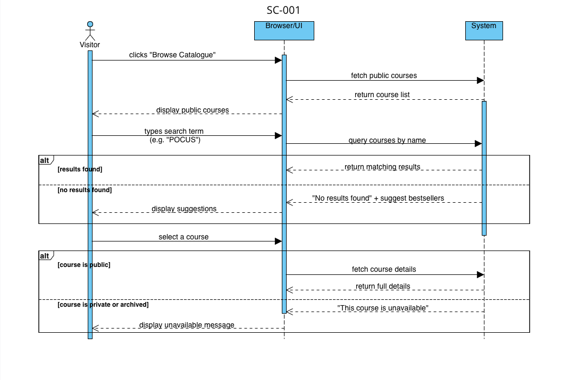
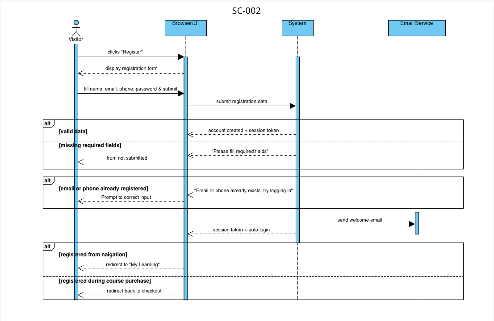
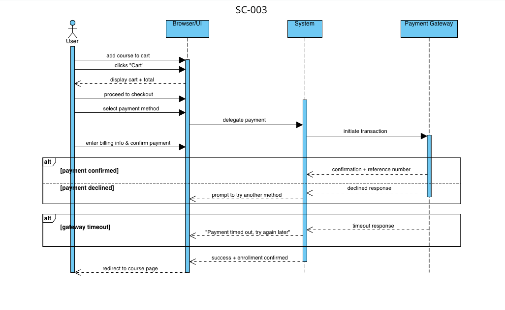
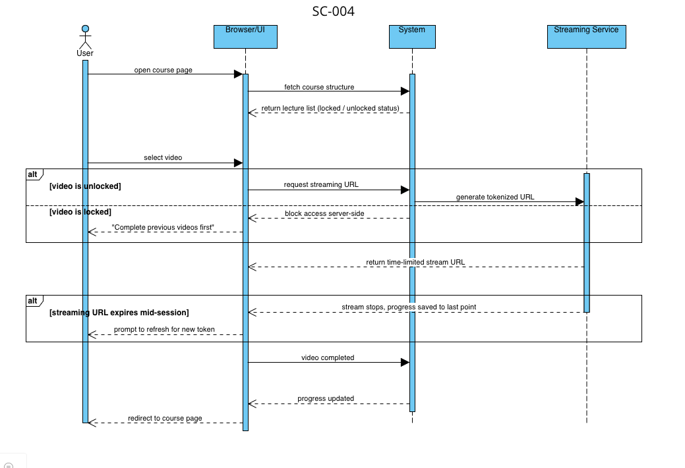
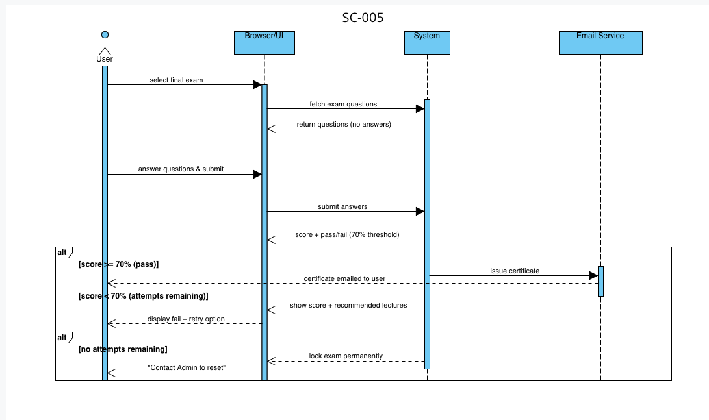
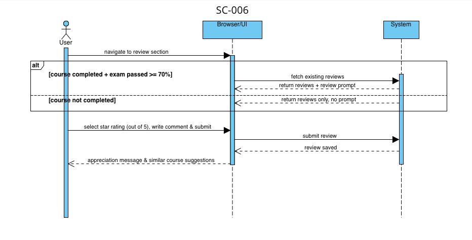
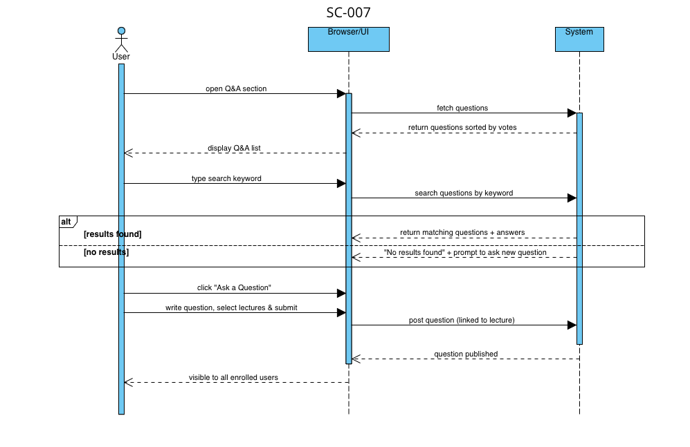
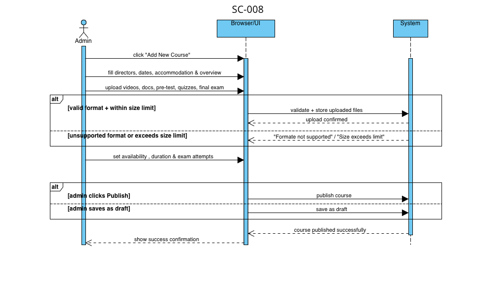
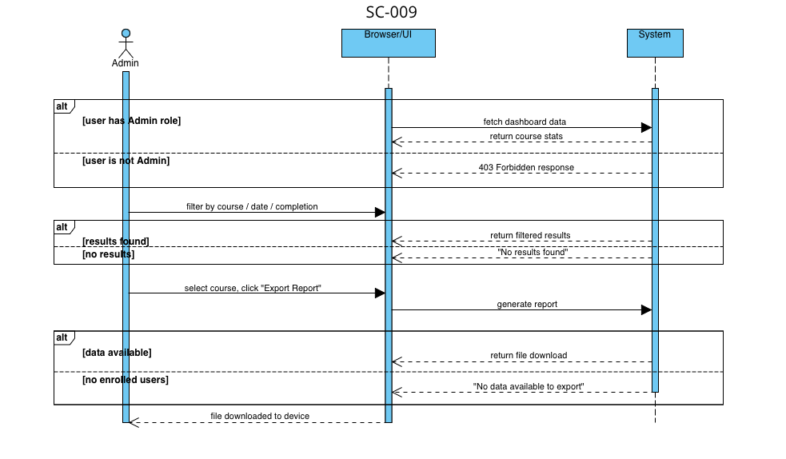

# Software Requirements Specification

## Sonoschool

## Document Control

| Field                | Value                                     |
| -------------------- | ----------------------------------------- |
| Document version     | V1.8                                      |
| Status               | Draft                                     |
| Authors              | Mohamed Hany, Malak Foudh, Noureen Mohammed, Omar Khalifa, Badr Mohamed |
| Supervisor           | Mohamed Hany                              |
| Faculty / University | MSA - Modern Sciences and Arts University |
| Date of issue        | 21-05-2026                                |

### Revision History

| Version | Date       | Author           | Description                                              |
| ------- | ---------- | ---------------- | -------------------------------------------------------- |
| V1.0    | 14-05-2026 | Mohamed Hany     | Created the first version of the document.               |
| V1.1    | 15-05-2026 | Mohamed Hany     | Wrote the functional requirements section.               |
| V1.2    | 16-05-2026 | Malak Foudh      | Wrote the introduction and general description sections. |
| V1.3    | 21-05-2026 | Malak Foudh      | Added the class diagram and some functional requirements. |
| V1.4    | 21-05-2026 | Noureen Mohammed | Added the non-functional requirements section.           |
| V1.5    | 21-05-2026 | Omar Khalifa     | Added the operational scenarios.                         |
| V1.6    | 21-05-2026 | Noureen Mohammed | Added the performance requirements and the interface requirements section. |
| V1.7    | 21-05-2026 | Omar Khalifa     | Added the sequence diagrams.                             |
| V1.8    | 21-05-2026 | Mohamed Hany     | Reviewed the whole document and fixed consistency issues. |

## 1. Introduction

### 1.1 Purpose of this Document

The purpose of this document is to present a detailed description of **Sonoschool**, a web-based academic medical learning platform. It will explain the features of the system, the interfaces through which users interact with it, what the system will do, the constraints under which it must operate, and how the system will react to external inputs. This document is intended for both the **developers** responsible for building the system and the **stakeholders** who have a direct interest in its outcome.

### 1.2 Scope
#### In Scope

The following capabilities fall within the boundary of this project:

- **User management** — registration, login, profile management, and role-based access for two user types: Student, and Administrator.
- **Course catalogue** — browsing, searching, filtering, and sorting of available courses.
- **Enrollment and payments** — course enrollment with integrated payment processing (checkout, order history).
- **Content delivery** — structured course pages presenting video lectures, written material, and downloadable resources.
- **Progress tracking** — per-student tracking of lesson completion and overall course progress.
- **Completion certificates** — Administrators upload completion certificates for students; students can view and download their certificates once the Administrator has uploaded them.
- **Admin dashboard** — content moderation, user management, and basic reporting for platform administrators.

#### Out of Scope

The following are explicitly excluded from this release:

- Native mobile applications (iOS / Android) — the platform is web-only.
- Live-streaming or real-time video conferencing between instructors and students.
- Multi-language (i18n) support beyond English.
- Offline content access or downloadable course packages.
- Advanced analytics dashboards or business-intelligence reporting.

### 1.3 Overview

Sonoschool is a web-based platform that allows students to browse, enroll in, and follow online courses, while administrators manage content, users, and completion certificates. The rest of this document is organized as follows: Section 2 gives a general description of the product, its functions, and its users. Section 3 covers the functional requirements in detail. Section 4 describes the system's interfaces. Sections 5 and 6 address performance requirements and design constraints. Section 7 lists non-functional attributes. Sections 8 through 10 present system diagrams, operational scenarios, and the project schedule. Sections 11 and 12 cover the appendices and references.

### 1.4 Business Context

Sonoschool is an academic medical learning platform aimed at healthcare professionals and medical students who need access to structured, field-specific courses online. The organization behind Sonoschool recognized that medical learners lack a dedicated platform that combines course access, progress tracking, and certified completion in one place. Sonoschool was built to address that need by offering a focused, easy-to-use environment for continuous medical education.

#### 1.4.1 Mission Statement

The mission of Sonoschool is to provide a secure, accessible, and user-friendly platform for delivering academic medical education online — enabling healthcare professionals and students to enroll in courses, track their learning progress, and obtain verified completion certificates with ease.

#### 1.4.2 Organizational Objectives

1. Provide medical learners with a clear and organized platform to browse, enroll in, and complete relevant healthcare courses.
2. Enable students to monitor their learning progress and receive completion certificates uploaded by platform administrators.
3. Give administrators full control over course content, user management, and certification to maintain the quality and credibility of the platform.

## 2. General Description

### 2.1 Product Functions

1. **User Registration and Login** — Users can create an account and securely log in to access the platform.
2. **Course Browsing, Filtering, and Sorting** — Students can explore the course catalogue and filter or sort results by category, price, or other criteria.
3. **Course Enrollment and Payment** — Students can enroll in a course by completing a secure payment process.
4. **Content Delivery** — Enrolled students can access course materials including video lectures and supporting resources.
5. **Progress Tracking** — The system tracks each student's completion status across course lessons and displays their overall progress.
6. **Completion Certificates** — Once a student completes a course, administrators can upload a certificate which the student can then view and download.
7. **Admin Dashboard** — Administrators can manage users, courses, and certificates through a dedicated control panel.

### 2.2 Similar System Information

Sonoschool is a stand-alone web application. It does not replace or integrate with any existing learning management system. The only external integration is a third-party payment gateway used to process course enrollment payments.

Several platforms offer comparable functionality and serve as a reference point for Sonoschool's design:

- **Udemy** — a general-purpose online learning marketplace where instructors publish courses and students enroll and track progress. Sonoschool follows a similar enrollment and content structure but is focused exclusively on medical education.
- **Coursera** — an academic online learning platform offering courses from universities and institutions. Like Sonoschool, it supports structured course content and issues completion certificates.
- **Lecturio** — a medical-specific e-learning platform targeting healthcare students and professionals, making it the closest comparable system to Sonoschool in terms of target audience and content domain.

Unlike these platforms, Sonoschool is a focused, lightweight solution where certificates are managed and uploaded directly by administrators rather than being automatically generated.

### 2.3 User Characteristics

| User type | Expected expertise | Domain knowledge |
| --- | --- | --- |

| **Student** | Basic computer literacy; comfortable browsing the web and using online forms | Medical background; seeking to expand knowledge through structured online courses |
| **Administrator** | Moderate technical proficiency; able to manage a web-based dashboard and handle file uploads | Familiar with platform operations; responsible for publishing courses, managing users, and issuing certificates |

### 2.4 User Problem Statement

**Students** in the medical field often find it difficult to access well-structured, reliable courses online. Resources are scattered across different websites, there is no consistent way to track how far they have progressed, and completing a course rarely results in any formal proof of achievement. This makes it hard for medical learners to manage their own education or demonstrate their professional development.

**Administrators** face the challenge of managing course content, user accounts, and certificates without a centralized tool. Without a dedicated platform, these tasks become time-consuming and error-prone.

Sonoschool addresses both problems by bringing course access, progress tracking, and certificate management together in one organized, easy-to-use platform.

### 2.5 User Objectives

**Students:**
1. Find and enroll in relevant medical courses quickly and without difficulty.
2. Follow course content in a structured, self-paced manner and keep track of their progress.
3. Obtain a completion certificate as proof of their learning once they finish a course.

**Administrators:**
1. Publish and manage course content through a simple, centralized dashboard.
2. Oversee user accounts and control access to the platform.
3. Upload and manage completion certificates for students who have finished their courses.

**Wish list (desirable but not guaranteed in this release):**
- Students would like to receive email notifications when their certificate is ready to download.
- Administrators would like a reporting view showing enrollment numbers and completion rates per course.

### 2.6 General Constraints

1. The system must run on standard web browsers (Chrome, Firefox, Edge, Safari) without requiring any software installation on the user's device.
2. All communication between the client and the server must be transmitted over HTTPS to ensure data security.
3. The system must be implemented using the agreed technology stack — React / Next.js for the front-end and Node.js for the back-end — and must not depend on proprietary or paid enterprise tools.
4. Payment processing must be handled through a third-party payment gateway and must not store sensitive card details on the platform's own servers.
5. The platform is web-only; no native mobile application will be developed in this release.

## 3. Functional Requirements

This section specifies the functional requirements of the system. Each requirement is expressed using a Requirement Pattern; every FR appears below as a single table grouping the catalogue fields, pattern application, pre/post conditions, risks, acceptance criteria, follow-on requirements, and considerations for development and testing.

The requirements draw on patterns from all eight Requirement Pattern domains: **Fundamental**, **Information**, **Data Entity**, **User Function**, **Access Control**, **Performance**, **Flexibility**, and **Commercial**. The functional requirements below use the Information, Data Entity, User Function, Access Control, and Commercial domains; the Fundamental and Flexibility domains are covered by the Pervasive Requirements in §3.2; and the Performance domain is covered by §5 (Performance Requirements).

### 3.1 Summary

| Identifier | Name                                      | Priority    | Pattern                                | Domain         |
| ---------- | ----------------------------------------- | ----------- | -------------------------------------- | -------------- |
| FR-001     | Register New User                         | Must have   | User registration                      | Access Control |
| FR-002     | Authenticate Returning User               | Must have   | User authentication                    | Access Control |
| FR-003     | Log Out User Session                      | Must have   | User authentication (follow-on)        | Access Control |
| FR-004     | Change User Password                      | Should have | User authentication (follow-on)        | Access Control |
| FR-005     | Edit User Personal Information            | Should have | Living entity                          | Data Entity    |
| FR-005.1   | Update Profile Picture                    | Could have  | Living entity (follow-on)              | Data Entity    |
| FR-006     | Browse Course Catalog                     | Must have   | Inquiry                                | User Function  |
| FR-006.1   | Search Courses by Keyword                 | Should have | Inquiry (follow-on)                    | User Function  |
| FR-006.2   | Filter and Sort Courses                   | Should have | Inquiry (follow-on)                    | User Function  |
| FR-007     | Manage Course Cart                        | Should have | Living entity                          | Data Entity    |
| FR-008     | Pay Course Fees via Stripe                | Must have   | Transaction + Inter-system interaction + Fee/tax | Data Entity + Commercial |
| FR-009     | Enroll Student in Paid Course             | Must have   | Transaction                            | Data Entity    |
| FR-010     | View Enrolled Courses                     | Must have   | Inquiry                                | User Function  |
| FR-011     | View Lecture Content                      | Must have   | Inquiry + Inter-system interaction     | User Function  |
| FR-012     | Unlock Next Lecture Sequentially          | Must have   | Specific authorization                 | Access Control |
| FR-013     | Track Course Progress                     | Must have   | Calculation formula                    | Information    |
| FR-014     | Ask Question on Lecture                   | Could have  | Transaction                            | Data Entity    |
| FR-015     | Search Course Questions                   | Could have  | Inquiry                                | User Function  |
| FR-016     | Answer Course Question                    | Should have | Transaction                            | Data Entity    |
| FR-017     | Submit Course Review                      | Should have | Transaction                            | Data Entity    |
| FR-018     | View Course Reviews                       | Should have | Inquiry                                | User Function  |
| FR-019     | Compute Average Course Rating             | Should have | Calculation formula                    | Information    |
| FR-020     | Attempt Course Exam                       | Must have   | Transaction                            | Data Entity    |
| FR-020.1   | Flag Exam Question for Review             | Could have  | Transaction (follow-on)                | Data Entity    |
| FR-020.2   | Navigate Between Exam Questions           | Should have | Inquiry (follow-on)                    | User Function  |
| FR-020.3   | Review Exam Answers Before Submission     | Should have | Inquiry (follow-on)                    | User Function  |
| FR-020.4   | Submit Exam for Grading                   | Must have   | Transaction (follow-on)                | Data Entity    |
| FR-021     | Issue Course Completion Certificate       | Must have   | Transaction + Inter-system interaction | Data Entity    |
| FR-022     | View and Download Certificate             | Must have   | Inquiry                                | User Function  |
| FR-023     | Verify Certificate Authenticity           | Should have | Inquiry                                | User Function  |
| FR-024     | View Notifications                        | Could have  | Inquiry                                | User Function  |
| FR-025     | View Student Dashboard                    | Should have | Inquiry                                | User Function  |
| FR-026     | Authorize Admin-Only Actions              | Must have   | Specific authorization                 | Access Control |
| FR-027     | Create New Course                         | Must have   | Living entity                          | Data Entity    |
| FR-027.1   | Edit Course Details                       | Should have | Living entity (follow-on)              | Data Entity    |
| FR-027.2   | Delete Course (draft only)                | Could have  | Living entity (follow-on)              | Data Entity    |
| FR-028     | Upload Lecture Content                    | Must have   | Transaction                            | Data Entity    |
| FR-028.1   | Reorder Lectures within Course            | Could have  | Living entity (follow-on)              | Data Entity    |
| FR-029     | Set Course Availability Duration          | Should have | Configuration                          | Data Entity    |
| FR-030     | Publish Course to Catalog                 | Must have   | Approval                               | Access Control |
| FR-031     | Manage User Accounts                      | Should have | Living entity                          | Data Entity    |
| FR-032     | Generate Monthly Revenue Report           | Could have  | Report                                 | User Function  |
| FR-033     | Generate Active Users Report              | Could have  | Report                                 | User Function  |
| FR-034     | Configure Platform Settings               | Could have  | Configuration                          | Data Entity    |
| FR-035     | View System Audit Log                     | Should have | Inquiry                                | User Function  |
| FR-036     | Create Course Exam                        | Must have   | Living entity                          | Data Entity    |
| FR-036.1   | Add Question with Multiple-Choice Options | Must have   | Living entity (follow-on)              | Data Entity    |
| FR-036.2   | Configure Exam Settings                   | Should have | Configuration (follow-on)              | Data Entity    |
| FR-036.3   | Delete Exam Question (draft only)         | Could have  | Living entity (follow-on)              | Data Entity    |
| FR-037     | Reset Student Exam Attempts               | Should have | Transaction                            | Data Entity    |
| FR-038     | Archive Course                            | Should have | Data archiving                         | Information    |
| FR-038.1   | Restore Archived Course                   | Could have  | Data archiving (follow-on)             | Information    |
| FR-039     | Unenroll Student from Course              | Should have | Transaction                            | Data Entity    |

### 3.2 Pervasive Requirements

| Identifier | Pattern              | Pattern domain | Statement |
| ---------- | -------------------- | -------------- | --------- |
| PRV-001    | User authentication  | Access Control | All FRs except FR-001, FR-002, FR-006 (and its follow-ons), and FR-023 require an active authenticated session. |
| PRV-002    | Comply-with-standard | Fundamental    | All paid lesson content shall be served with `Cache-Control: no-store` and a per-user watermark. |
| PRV-003    | Chronicle            | Data Entity    | Every Transaction-pattern FR shall append an immutable audit record (actor, action, timestamp). |
| PRV-004    | Accessibility        | User Function  | Every user-facing screen shall be accessible and easy to use, with clear navigation, readable text, and sufficient colour contrast. |
| PRV-005    | Multi-lingual        | Flexibility    | All user-facing strings (UI labels, error messages, and notification templates) shall be served from a translation catalogue supporting English and Arabic, with right-to-left layout automatically applied when Arabic is selected. |
| PRV-006    | Inter-system interaction | Fundamental | All outbound emails (welcome email on registration, certificate email on issuance) shall be sent through the external Email Service. |

### 3.3 Requirement Details

#### FR-001

| Field | Value |
| ----- | ----- |
| Identifier | FR-001 |
| Name | Register New User |
| Type | Functional |
| Priority | Must have |
| Source | HR, interview, 12-03-2026 |
| Owner | Malak Foudh |
| Author | Malak Foudh |
| Business area | Identity & Access |
| Stakeholders | Visitor |
| Pattern used | User registration |
| Pattern domain | Access Control |
| Related patterns | **refers to** User authentication (FR-002), **refers to** Specific authorization (FR-026) for role assignment, **triggers** Email via PRV-006 |
| Classification (Functional / Pervasive / Affects DB) | Functional: Yes / Pervasive: No / Affects DB: Yes |
| Applicability | Applies whenever a visitor wants to create a Sonoschool account; admin accounts are provisioned separately and do not use this FR. |
| Description | The system shall allow a visitor to register a new Student account by providing name, email, phone number, and a password of at least 8 characters with at least one letter and one digit; upon successful registration the system shall create an active account with role "Student", auto-login the user with a session token, and send a welcome email through the Email Service. |
| Pre-condition | The supplied email and phone are not already registered and the password is at least 8 characters with at least one letter and one digit. |
| Post-condition | An active User record with role "Student" is created, a session token is issued, and a welcome email is sent. |
| Dependencies | None |
| Associated NFRs | NFR-001 Security; NFR-002 Reliability; NFR-005 Usability |
| Related requirements | FR-002 Authenticate Returning User |
| Related documents | None |
| Acceptance criteria | [ ] A valid registration creates a User account, issues a session token, and sends a welcome email. [ ] A duplicate email or phone is rejected. [ ] A weak password is rejected with a clear message. |
| Follow-on requirements | N/A |
| Considerations for development | Hash passwords with bcrypt; never store the plain password; call the Email Service after the account row is committed. |
| Considerations for testing | [ ] Test the password validator. [ ] Test duplicate-email and duplicate-phone handling. [ ] Test that a welcome email is sent. |
| Comments | Auto-login: after register, the user lands on "My Learning" by default or returns to checkout if registration happened during course purchase. |
| Version history | v1.0 — 12-03-2026 — Malak Foudh |

#### FR-002

| Field | Value |
| ----- | ----- |
| Identifier | FR-002 |
| Name | Authenticate Returning User |
| Type | Functional |
| Priority | Must have |
| Source | Operational Director, interview, 12-03-2026 |
| Owner | Mohamed Hany |
| Author | Mohamed Hany |
| Business area | Identity & Access |
| Stakeholders | Student, Admin |
| Pattern used | User authentication |
| Pattern domain | Access Control |
| Related patterns | **refers to** User registration (FR-001), **extended by** Specific authorization (FR-026) |
| Classification (Functional / Pervasive / Affects DB) | Functional: Yes / Pervasive: No / Affects DB: Yes |
| Applicability | The system has restricted resources (enrolled courses, profile, admin functions) and must verify identity before granting access. |
| Description | The system shall authenticate a returning user by verifying their email and password against stored credentials and, on success, issue a JWT session token. |
| Pre-condition | The user has a registered, active account. |
| Post-condition | A JWT session token is issued, a login event is appended to the chronicle (PRV-003), and the user is redirected to the dashboard. |
| Dependencies | FR-001 |
| Associated NFRs | NFR-001 Security; NFR-002 Reliability |
| Related requirements | FR-003 Log Out User Session; FR-004 Change User Password; FR-026 Authorize Admin-Only Actions |
| Related documents | None |
| Acceptance criteria | [ ] Valid credentials return a session token and the user is logged in. [ ] Invalid credentials are rejected. |
| Follow-on requirements | FR-003 Log Out User Session; FR-004 Change User Password |
| Considerations for development | Use bcryptjs to verify the password hash; issue a JWT on success. |
| Considerations for testing | [ ] Test the verification function. |
| Comments | PRV-001 makes authentication mandatory for every other FR except FR-001, FR-002, FR-006, and FR-023. |
| Version history | v1.0 — 12-03-2026 — Mohamed Hany |

#### FR-003

| Field | Value |
| ----- | ----- |
| Identifier | FR-003 |
| Name | Log Out User Session |
| Type | Functional |
| Priority | Must have |
| Source | Operational Director, interview, 12-03-2026 |
| Owner | Mohamed Hany |
| Author | Malak Foudh |
| Business area | Identity & Access |
| Stakeholders | Student, Admin |
| Pattern used | User authentication |
| Pattern domain | Access Control |
| Related patterns | **follow-on of** Authenticate Returning User (FR-002) |
| Classification (Functional / Pervasive / Affects DB) | Functional: Yes / Pervasive: No / Affects DB: No |
| Applicability | Applies whenever an authenticated user wants to terminate their session, or when the session expires through inactivity. |
| Description | The system shall invalidate the active session token of an authenticated user upon explicit logout request and return them to the public landing page. |
| Pre-condition | The user has an active authenticated session. |
| Post-condition | The session is ended and a logout event is appended to the chronicle. |
| Dependencies | FR-002 |
| Associated NFRs | NFR-001 Security |
| Related requirements | FR-002 Authenticate Returning User |
| Related documents | None |
| Acceptance criteria | [ ] Logout ends the session and clears the session cookie. [ ] The logout event is recorded in the audit chronicle. |
| Follow-on requirements | N/A |
| Considerations for development | Clear cookies on the client and redirect to the public landing page. |
| Considerations for testing | [ ] Confirm the user lands on the public page after logout. |
| Comments | |
| Version history | v1.0 — 12-03-2026 — Malak Foudh |

#### FR-004

| Field | Value |
| ----- | ----- |
| Identifier | FR-004 |
| Name | Change User Password |
| Type | Functional |
| Priority | Should have |
| Source | Operational Director, interview, 12-03-2026 |
| Owner | Mohamed Hany |
| Author | Mohamed Hany |
| Business area | Identity & Access |
| Stakeholders | Student, Admin |
| Pattern used | User authentication (follow-on) |
| Pattern domain | Access Control |
| Related patterns | **follow-on of** User authentication (FR-002) |
| Classification (Functional / Pervasive / Affects DB) | Functional: Yes / Pervasive: No / Affects DB: Yes |
| Applicability | Applies whenever an authenticated user wants to change their password. |
| Description | The system shall allow an authenticated user to change their password by providing the current password and a new password of at least 8 characters with at least one letter and one digit. |
| Pre-condition | The user is authenticated and supplies the correct current password. |
| Post-condition | The stored password hash is updated and all other active sessions for the user are signed out. |
| Dependencies | FR-002 |
| Associated NFRs | NFR-001 Security |
| Related requirements | FR-002 Authenticate Returning User; FR-003 Log Out User Session |
| Related documents | None |
| Acceptance criteria | [ ] A correct current password and a valid new password update the password. [ ] A wrong current password is rejected. [ ] Other active sessions for the user are signed out. |
| Follow-on requirements | N/A |
| Considerations for development | Re-hash the new password with bcrypt. |
| Considerations for testing | [ ] Check the old password no longer works. [ ] Check other devices are logged out. |
| Comments | |
| Version history | v1.0 — 12-03-2026 — Mohamed Hany |

#### FR-005

| Field | Value |
| ----- | ----- |
| Identifier | FR-005 |
| Name | Edit User Personal Information |
| Type | Functional |
| Priority | Should have |
| Source | HR, interview, 12-03-2026 |
| Owner | Mohamed Hany |
| Author | Malak Foudh |
| Business area | Profile Management |
| Stakeholders | Student |
| Pattern used | Living entity |
| Pattern domain | Data Entity |
| Related patterns | **refers to** User authentication (FR-002) |
| Classification (Functional / Pervasive / Affects DB) | Functional: Yes / Pervasive: No / Affects DB: Yes |
| Applicability | Applies whenever an authenticated user wants to update non-credential profile fields. |
| Description | The system shall allow an authenticated user to update their profile attributes mentioned in the Class Diagram through the profile-edit screen. |
| Pre-condition | The user is authenticated and the new values pass validation. |
| Post-condition | The user's profile record is updated with the new values. |
| Dependencies | FR-002 |
| Associated NFRs | NFR-001 Security; NFR-005 Usability |
| Related requirements | FR-002 Authenticate Returning User; FR-005.1 Update Profile Picture |
| Related documents | None |
| Acceptance criteria | [ ] Valid profile data is saved and shown on re-fetch. [ ] An overly long display name is rejected. |
| Follow-on requirements | FR-005.1 Update Profile Picture |
| Considerations for development | Save only the fields the client sent (partial update). |
| Considerations for testing | [ ] Check that only the changed fields are updated. |
| Comments | |
| Version history | v1.0 — 12-03-2026 — Malak Foudh |

#### FR-005.1

| Field | Value |
| ----- | ----- |
| Identifier | FR-005.1 |
| Name | Update Profile Picture |
| Type | Functional |
| Priority | Could have |
| Source | HR, interview, 12-03-2026 |
| Owner | Mohamed Hany |
| Author | Malak Foudh |
| Business area | Profile Management |
| Stakeholders | Student |
| Pattern used | Living entity (follow-on) |
| Pattern domain | Data Entity |
| Related patterns | **follow-on of** Living entity (FR-005) |
| Classification (Functional / Pervasive / Affects DB) | Functional: Yes / Pervasive: No / Affects DB: Yes |
| Applicability | Applies whenever an authenticated user wants to upload or change their profile picture. |
| Description | The system shall allow an authenticated user to upload a profile picture (JPEG or PNG) that replaces the user's previous picture on the profile. |
| Pre-condition | The user is authenticated. |
| Post-condition | The user's profile picture reference points to the newly uploaded image. |
| Dependencies | FR-005 |
| Associated NFRs | NFR-001 Security; NFR-008 Resource utilization |
| Related requirements | FR-005 Edit User Personal Information |
| Related documents | None |
| Acceptance criteria | [ ] A JPEG or PNG upload succeeds and the new picture shows on the profile. [ ] A non-image file is rejected. |
| Follow-on requirements | N/A |
| Considerations for development | Store images in object storage; store only the reference URL in the DB. |
| Considerations for testing | [ ] Check the old image is no longer reachable after a successful replace. |
| Comments | |
| Version history | v1.0 — 12-03-2026 — Malak Foudh |

#### FR-006

| Field | Value |
| ----- | ----- |
| Identifier | FR-006 |
| Name | Browse Course Catalog |
| Type | Functional |
| Priority | Must have |
| Source | Operational Director, interview, 12-03-2026 |
| Owner | Mohamed Hany |
| Author | Mohamed Hany |
| Business area | Course Catalog |
| Stakeholders | Visitor, Student |
| Pattern used | Inquiry |
| Pattern domain | User Function |
| Related patterns | **extended by** FR-006.1 (Search), FR-006.2 (Filter and Sort) |
| Classification (Functional / Pervasive / Affects DB) | Functional: Yes / Pervasive: No / Affects DB: No |
| Applicability | Applies whenever any visitor or student wants to discover what courses Sonoschool offers. Public endpoint (no auth required for this view). |
| Description | There shall be a Course Catalog inquiry that displays the list of published courses, showing for each course: title, instructor name, category, price, and average rating. |
| Pre-condition | At least one published course exists in the system. |
| Post-condition | The catalog is displayed and no system state is changed. |
| Dependencies | FR-027 (courses must be created); FR-030 (courses must be published) |
| Associated NFRs | NFR-002 Reliability; NFR-005 Usability; PR-001 Response time |
| Related requirements | FR-006.1 Search Courses by Keyword; FR-006.2 Filter and Sort Courses; FR-019 Compute Average Course Rating |
| Related documents | PRV-004 (Accessibility); PRV-005 (Multi-lingual) |
| Acceptance criteria | [ ] Only published courses appear — archived and draft courses do not. [ ] Each row shows title, instructor, category, price, and rating. |
| Follow-on requirements | FR-006.1 Search Courses by Keyword; FR-006.2 Filter and Sort Courses |
| Considerations for development | Use pagination so large catalogs load quickly. |
| Considerations for testing | [ ] Check that draft and archived courses never appear. |
| Comments | Public endpoint — exempt from PRV-001 (auth required). |
| Version history | v1.0 — 12-03-2026 — Mohamed Hany |

#### FR-006.1

| Field | Value |
| ----- | ----- |
| Identifier | FR-006.1 |
| Name | Search Courses by Keyword |
| Type | Functional |
| Priority | Should have |
| Source | Operational Director, interview, 12-03-2026 |
| Owner | Mohamed Hany |
| Author | Mohamed Hany |
| Business area | Course Catalog |
| Stakeholders | Visitor, Student |
| Pattern used | Inquiry (follow-on) |
| Pattern domain | User Function |
| Related patterns | **follow-on of** Inquiry (FR-006) |
| Classification (Functional / Pervasive / Affects DB) | Functional: Yes / Pervasive: No / Affects DB: No |
| Applicability | Applies whenever a user wants to narrow the catalog by free-text search. |
| Description | There shall be a Search inquiry that displays the subset of published courses whose title, instructor name, or category matches the user-supplied keyword. When no results are found, the system shall display a "No results found" message together with a list of suggested bestsellers. |
| Pre-condition | The user is on the Course Catalog screen. |
| Post-condition | The matching subset of courses (or the suggestion list) is displayed and no system state is changed. |
| Dependencies | FR-006 |
| Associated NFRs | PR-001 Response time |
| Related requirements | FR-006 Browse Course Catalog; FR-006.2 Filter and Sort Courses |
| Related documents | None |
| Acceptance criteria | [ ] Keyword matches return only published courses. [ ] An empty keyword returns the full catalog. [ ] A no-match query shows "No results found" with suggestions. |
| Follow-on requirements | N/A |
| Considerations for development | |
| Considerations for testing | [ ] Check that draft and archived courses never appear in search results. [ ] Check the no-results suggestion list. |
| Comments | |
| Version history | v1.0 — 12-03-2026 — Mohamed Hany |

#### FR-006.2

| Field | Value |
| ----- | ----- |
| Identifier | FR-006.2 |
| Name | Filter and Sort Courses |
| Type | Functional |
| Priority | Should have |
| Source | Operational Director, interview, 12-03-2026 |
| Owner | Mohamed Hany |
| Author | Malak Foudh |
| Business area | Course Catalog |
| Stakeholders | Visitor, Student |
| Pattern used | Inquiry (follow-on) |
| Pattern domain | User Function |
| Related patterns | **follow-on of** Inquiry (FR-006) |
| Classification (Functional / Pervasive / Affects DB) | Functional: Yes / Pervasive: No / Affects DB: No |
| Applicability | Applies whenever a user wants to narrow the catalog by structured criteria rather than free-text. |
| Description | There shall be a Filter-and-Sort inquiry that narrows the Course Catalog by category, price range, and rating, and orders the result by price, popularity, or rating. |
| Pre-condition | The user is on the Course Catalog screen. |
| Post-condition | The filtered and sorted subset of courses is displayed and no system state is changed. |
| Dependencies | FR-006 |
| Associated NFRs | PR-001 Response time; NFR-005 Usability |
| Related requirements | FR-006 Browse Course Catalog; FR-006.1 Search Courses by Keyword |
| Related documents | None |
| Acceptance criteria | [ ] Filtering by category returns only courses in that category. [ ] The price range respects both the minimum and maximum. [ ] Sort options change the order as expected. |
| Follow-on requirements | N/A |
| Considerations for development | |
| Considerations for testing | [ ] Check different filter and sort combinations. |
| Comments | |
| Version history | v1.0 — 12-03-2026 — Malak Foudh |

#### FR-007

| Field | Value |
| ----- | ----- |
| Identifier | FR-007 |
| Name | Manage Course Cart |
| Type | Functional |
| Priority | Should have |
| Source | Operational Director, interview, 12-03-2026 |
| Owner | Mohamed Hany |
| Author | Mohamed Hany |
| Business area | Payments |
| Stakeholders | Student |
| Pattern used | Living entity |
| Pattern domain | Data Entity |
| Related patterns | **feeds** FR-008 (Pay Course Fees via Stripe) |
| Classification (Functional / Pervasive / Affects DB) | Functional: Yes / Pervasive: No / Affects DB: Yes |
| Applicability | Applies whenever an authenticated student wants to gather one or more courses before checkout. |
| Description | The system shall provide a Course Cart that lets a student add courses, remove courses, view the cart with the running total, and proceed to checkout. |
| Pre-condition | The student is authenticated. |
| Post-condition | The cart reflects the student's current selection and is ready to feed FR-008 on checkout. |
| Dependencies | FR-002 |
| Associated NFRs | NFR-005 Usability |
| Related requirements | FR-006 Browse Course Catalog; FR-008 Pay Course Fees via Stripe |
| Related documents | None |
| Acceptance criteria | [ ] Adding a course shows it in the cart with its price. [ ] Removing a course removes it from the cart. [ ] The cart total equals the sum of item prices. |
| Follow-on requirements | N/A |
| Considerations for development | Store the cart per user; reject adding a course the student is already enrolled in. |
| Considerations for testing | [ ] Add and remove courses and check the total. [ ] Try to add an already-enrolled course and check it is rejected. |
| Comments | Empty cart is allowed; checkout is blocked when the cart is empty. |
| Version history | v1.4 — 21-05-2026 — Mohamed Hany |

#### FR-008

| Field | Value |
| ----- | ----- |
| Identifier | FR-008 |
| Name | Pay Course Fees via Stripe |
| Type | Functional |
| Priority | Must have |
| Source | Operational Director, interview, 12-03-2026 |
| Owner | Mohamed Hany |
| Author | Malak Foudh |
| Business area | Payments |
| Stakeholders | Student |
| Pattern used | Transaction + Inter-system interaction + Fee/tax |
| Pattern domain | Data Entity + Commercial |
| Related patterns | **refers to** FR-007 (cart provides the basket), **refers to** FR-009 (Enrollment is the consequence) |
| Classification (Functional / Pervasive / Affects DB) | Functional: Yes / Pervasive: No / Affects DB: Yes |
| Applicability | Applies whenever an authenticated student proceeds to checkout from their cart. |
| Description | The system shall delegate payment to Stripe by creating a checkout session for the courses in the student's cart and, upon Stripe confirmation, record a Payment transaction containing buyer, courseIds, amount, currency, and Stripe reference number. |
| Pre-condition | The user is authenticated and the cart contains at least one course not already owned. |
| Post-condition | A Payment transaction record exists with status "Succeeded" and FR-009 is triggered for each purchased course. |
| Dependencies | FR-002; FR-006; FR-007 |
| Associated NFRs | NFR-001 Security; NFR-002 Reliability |
| Related requirements | FR-007 Manage Course Cart; FR-009 Enroll Student in Paid Course |
| Related documents | Stripe Checkout API docs |
| Acceptance criteria | [ ] Checkout creates a Stripe session and returns the redirect URL. [ ] A confirmed payment triggers enrollment (FR-009) and returns a reference number. [ ] A declined payment prompts the user to try another method. [ ] A gateway timeout shows a clear retry message and creates no enrollment. |
| Follow-on requirements | N/A |
| Considerations for development | Check Stripe webhook signatures; make the webhook handler safe to retry. |
| Considerations for testing | [ ] Replay a webhook and check no duplicate enrollment is created. [ ] Simulate a declined payment and a gateway timeout. |
| Comments | Card data never touches our servers — Stripe Checkout hosts the form. |
| Version history | v1.0 — 12-03-2026 — Malak Foudh |

#### FR-009

| Field | Value |
| ----- | ----- |
| Identifier | FR-009 |
| Name | Enroll Student in Paid Course |
| Type | Functional |
| Priority | Must have |
| Source | Operational Director, interview, 12-03-2026 |
| Owner | Mohamed Hany |
| Author | Mohamed Hany |
| Business area | Course Access |
| Stakeholders | Student |
| Pattern used | Transaction |
| Pattern domain | Data Entity |
| Related patterns | **refers to** FR-008 (triggered by Payment), **reversed by** FR-039 Unenroll Student |
| Classification (Functional / Pervasive / Affects DB) | Functional: Yes / Pervasive: No / Affects DB: Yes |
| Applicability | Applies the instant a Payment transaction reaches status "Succeeded". |
| Description | The system shall create an Enrollment record linking the student to each purchased course immediately after a successful Payment transaction, granting the student access to the course content. |
| Pre-condition | A successful Payment transaction for the student/course pair exists (FR-008). |
| Post-condition | An Enrollment record exists per course and the student can access each course's content. |
| Dependencies | FR-008 |
| Associated NFRs | NFR-002 Reliability |
| Related requirements | FR-008 Pay Course Fees via Stripe; FR-010 View Enrolled Courses; FR-011 View Lecture Content; FR-039 Unenroll Student from Course |
| Related documents | None |
| Acceptance criteria | [ ] A successful payment creates exactly one Enrollment record per course. [ ] The student can open the course right after payment. |
| Follow-on requirements | N/A |
| Considerations for development | Use a unique index on (studentId, courseId) so duplicates cannot be created. |
| Considerations for testing | [ ] Replay a payment webhook and check only one Enrollment exists per course. |
| Comments | Internal trigger — never exposed as a public endpoint. |
| Version history | v1.0 — 12-03-2026 — Mohamed Hany |

#### FR-010

| Field | Value |
| ----- | ----- |
| Identifier | FR-010 |
| Name | View Enrolled Courses |
| Type | Functional |
| Priority | Must have |
| Source | Instructor, interview, 12-03-2026 |
| Owner | Mohamed Hany |
| Author | Malak Foudh |
| Business area | Course Access |
| Stakeholders | Student |
| Pattern used | Inquiry |
| Pattern domain | User Function |
| Related patterns | **refers to** FR-013 (progress percentage source) |
| Classification (Functional / Pervasive / Affects DB) | Functional: Yes / Pervasive: No / Affects DB: No |
| Applicability | Applies whenever an authenticated student opens the "My Courses" screen. |
| Description | There shall be a "My Courses" inquiry that displays the list of courses in which the currently authenticated student is enrolled, showing for each course: title, instructor, progress percentage. |
| Pre-condition | The student is authenticated. |
| Post-condition | The list is displayed and no system state is changed. |
| Dependencies | FR-002; FR-009 |
| Associated NFRs | PR-001 Response time; NFR-005 Usability |
| Related requirements | FR-009 Enroll Student in Paid Course; FR-013 Track Course Progress; FR-025 View Student Dashboard |
| Related documents | None |
| Acceptance criteria | [ ] Every course with an active enrollment is listed. [ ] An empty-state message shows when the student has no enrollments. |
| Follow-on requirements | N/A |
| Considerations for development | Join Enrollment and Course; skip enrollments with status "Revoked". |
| Considerations for testing | [ ] Check the empty state. |
| Comments | |
| Version history | v1.0 — 12-03-2026 — Malak Foudh |

#### FR-011

| Field | Value |
| ----- | ----- |
| Identifier | FR-011 |
| Name | View Lecture Content |
| Type | Functional |
| Priority | Must have |
| Source | Instructor, interview, 12-03-2026 |
| Owner | Mohamed Hany |
| Author | Mohamed Hany |
| Business area | Content Delivery |
| Stakeholders | Student |
| Pattern used | Inquiry + Inter-system interaction |
| Pattern domain | User Function |
| Related patterns | **refers to** FR-012 (sequential unlock), Governed by PRV-002 (content protection) |
| Classification (Functional / Pervasive / Affects DB) | Functional: Yes / Pervasive: No / Affects DB: No |
| Applicability | Applies whenever an enrolled student opens an unlocked lecture in a course they own. |
| Description | There shall be a Lecture Viewer that asks the external Streaming Service for a tokenized, time-limited stream URL for the selected lecture and renders the video plus supplementary materials to a student enrolled in its parent course. If the stream URL expires mid-session, the system shall save the student's progress to the last point reached and prompt the student to refresh for a new token. |
| Pre-condition | The student is authenticated, has an active enrollment for the lecture's course, and the lecture is unlocked (FR-012). |
| Post-condition | The lecture content is displayed and no system state is changed (except progress save on expiry). |
| Dependencies | FR-009; FR-012 |
| Associated NFRs | NFR-001 Security; NFR-002 Reliability; PR-001 Response time |
| Related requirements | FR-009 Enroll Student in Paid Course; FR-012 Unlock Next Lecture Sequentially |
| Related documents | PRV-002 (content protection headers + watermark) |
| Acceptance criteria | [ ] A student who is not enrolled cannot view the lecture. [ ] The video streams with a per-user watermark from the Streaming Service. [ ] An expired stream URL prompts a refresh and preserves progress. |
| Follow-on requirements | N/A |
| Considerations for development | Ask the Streaming Service for a time-limited URL on every play; overlay a watermark with the user's hashed ID; check enrollment on every request. |
| Considerations for testing | [ ] Try to open a lecture URL after logout. [ ] Let a token expire and check progress is saved and a refresh is offered. |
| Comments | The Streaming Service is an external system that issues tokenized URLs and serves the actual video. |
| Version history | v1.0 — 12-03-2026 — Mohamed Hany |

#### FR-012

| Field | Value |
| ----- | ----- |
| Identifier | FR-012 |
| Name | Unlock Next Lecture Sequentially |
| Type | Functional |
| Priority | Must have |
| Source | Medical Director, interview, 12-03-2026 |
| Owner | Mohamed Hany |
| Author | Mohamed Hany |
| Business area | Content Delivery |
| Stakeholders | Student |
| Pattern used | Specific authorization |
| Pattern domain | Access Control |
| Related patterns | **refers to** FR-011 (View Lecture Content) |
| Classification (Functional / Pervasive / Affects DB) | Functional: Yes / Pervasive: No / Affects DB: No |
| Applicability | Applies to every course lecture after the first; the first lecture and the read-only documents are unlocked on enrollment. |
| Description | The system shall keep each lecture locked until the student has completed the immediately preceding lecture, and shall enforce this order both in the client and on the server. A locked lecture shall return a "Complete previous videos first" message. |
| Pre-condition | The student is enrolled in the course and is requesting a lecture other than the first. |
| Post-condition | The lecture is accessible only if the preceding lecture is completed; otherwise access is denied. |
| Dependencies | FR-009 |
| Associated NFRs | NFR-001 Security |
| Related requirements | FR-011 View Lecture Content |
| Related documents | None |
| Acceptance criteria | [ ] The first lecture is available right after enrollment. [ ] A later lecture is locked until the previous one is completed. [ ] The lock is enforced on the server, not only in the UI. |
| Follow-on requirements | N/A |
| Considerations for development | Check the previous lecture's completion status in the lecture-access middleware; never rely on the client to hide the lock. |
| Considerations for testing | [ ] Ask for a locked lecture directly by URL and check it is denied. [ ] Complete a lecture and check the next one unlocks. |
| Comments | A lecture counts as completed once the student has finished viewing it. |
| Version history | v1.1 — 21-05-2026 — Mohamed Hany |

#### FR-013

| Field | Value |
| ----- | ----- |
| Identifier | FR-013 |
| Name | Track Course Progress |
| Type | Functional |
| Priority | Must have |
| Source | Instructor, interview, 12-03-2026 |
| Owner | Mohamed Hany |
| Author | Mohamed Hany |
| Business area | Content Delivery |
| Stakeholders | Student |
| Pattern used | Calculation formula |
| Pattern domain | Information |
| Related patterns | |
| Classification (Functional / Pervasive / Affects DB) | Functional: Yes / Pervasive: No / Affects DB: No |
| Applicability | Applies whenever the system or a student needs the completion percentage of an enrolled course. |
| Description | The system shall compute course progress as: progress % = (completed lectures / total lectures) × 100, recomputed whenever a lecture is completed. |
| Pre-condition | The student is enrolled in the course and the course has at least one lecture. |
| Post-condition | The current progress percentage is available to the dashboard and the "My Courses" view. |
| Dependencies | |
| Associated NFRs | NFR-002 Reliability |
| Related requirements | FR-010 View Enrolled Courses; FR-021 Issue Course Completion Certificate; FR-025 View Student Dashboard |
| Related documents | None |
| Acceptance criteria | [ ] Progress is 0% before any lecture is completed. [ ] Progress is 100% when all lectures are completed. [ ] Progress updates after each lecture is completed. |
| Follow-on requirements | N/A |
| Considerations for development | Save the percentage on the Enrollment record and recompute on each completion event. |
| Considerations for testing | [ ] Check the 0% and 100% boundaries. [ ] Check the recompute after each completion. |
| Comments | 100% progress plus a passing final exam (score ≥ 70%) is the trigger for FR-021. |
| Version history | v1.0 — 12-03-2026 — Mohamed Hany |

#### FR-014

| Field | Value |
| ----- | ----- |
| Identifier | FR-014 |
| Name | Ask Question on Lecture |
| Type | Functional |
| Priority | Could have |
| Source | Instructor, interview, 12-03-2026 |
| Owner | Mohamed Hany |
| Author | Malak Foudh |
| Business area | Course Q&A |
| Stakeholders | Student |
| Pattern used | Transaction |
| Pattern domain | Data Entity |
| Related patterns | **refers to** FR-015 (Search Course Questions), **refers to** FR-016 (Answer Course Question) |
| Classification (Functional / Pervasive / Affects DB) | Functional: Yes / Pervasive: No / Affects DB: Yes |
| Applicability | Applies whenever an enrolled student wants to ask a question linked to a specific lecture. |
| Description | The system shall allow an enrolled student to post a question that is linked to a specific lecture within a course they are enrolled in. |
| Pre-condition | The student is authenticated and enrolled in the course that contains the lecture. |
| Post-condition | A Question record is created, linked to the lecture and visible to everyone enrolled in the course. |
| Dependencies | FR-009 |
| Associated NFRs | NFR-002 Reliability |
| Related requirements | FR-015 Search Course Questions; FR-016 Answer Course Question |
| Related documents | None |
| Acceptance criteria | [ ] A question is posted and linked to the chosen lecture. [ ] A student not enrolled in the course cannot post a question. [ ] The question is visible to other enrolled students. |
| Follow-on requirements | N/A |
| Considerations for development | Save the lectureId on the Question record so questions can be grouped per lecture. |
| Considerations for testing | [ ] Check that a non-enrolled user is rejected. [ ] Check that the question appears for other enrolled students. |
| Comments | |
| Version history | v1.0 — 12-03-2026 — Malak Foudh |

#### FR-015

| Field | Value |
| ----- | ----- |
| Identifier | FR-015 |
| Name | Search Course Questions |
| Type | Functional |
| Priority | Could have |
| Source | Instructor, interview, 12-03-2026 |
| Owner | Mohamed Hany |
| Author | Mohamed Hany |
| Business area | Course Q&A |
| Stakeholders | Student |
| Pattern used | Inquiry |
| Pattern domain | User Function |
| Related patterns | **refers to** FR-014 (Ask Question on Lecture), **refers to** FR-016 (Answer Course Question) |
| Classification (Functional / Pervasive / Affects DB) | Functional: Yes / Pervasive: No / Affects DB: No |
| Applicability | Applies whenever an enrolled student wants to find existing questions inside a course before asking a new one. |
| Description | There shall be a Q&A inquiry that lets an enrolled student browse course questions, search them by keyword, and sort them by date or by the lecture they were asked at, showing each question with its answer. If no question matches the keyword, the system shall display a "No results found" message and prompt the student to ask a new question. |
| Pre-condition | The student is authenticated and enrolled in the course. |
| Post-condition | The matching questions are displayed and no system state is changed. |
| Dependencies | FR-014 |
| Associated NFRs | PR-001 Response time |
| Related requirements | FR-014 Ask Question on Lecture; FR-016 Answer Course Question |
| Related documents | None |
| Acceptance criteria | [ ] A keyword search returns matching questions with their answers. [ ] Sorting by date shows the newest question first. [ ] Sorting by lecture groups questions under the lecture they were asked at. [ ] An empty search result shows the "ask a new question" prompt. |
| Follow-on requirements | N/A |
| Considerations for development | Use a text index on the question text; expose sort as a query parameter. |
| Considerations for testing | [ ] Check search results. [ ] Check both sort orders. [ ] Check the empty-results prompt. |
| Comments | |
| Version history | v1.4 — 21-05-2026 — Mohamed Hany |

#### FR-016

| Field | Value |
| ----- | ----- |
| Identifier | FR-016 |
| Name | Answer Course Question |
| Type | Functional |
| Priority | Should have |
| Source | Instructor, interview, 12-03-2026 |
| Owner | Mohamed Hany |
| Author | Mohamed Hany |
| Business area | Course Q&A |
| Stakeholders | Admin, Student |
| Pattern used | Transaction |
| Pattern domain | Data Entity |
| Related patterns | **follow-on of** FR-014 (Ask Question on Lecture), **gated by** FR-026 (Authorize Admin-Only Actions) |
| Classification (Functional / Pervasive / Affects DB) | Functional: Yes / Pervasive: No / Affects DB: Yes |
| Applicability | Applies whenever an Admin answers a question asked inside a course. |
| Description | The system shall allow only an Admin to post an answer to a course question, and the answer shall be visible to everyone enrolled in the course. |
| Pre-condition | The Admin is authenticated and authorized (FR-026) and the target question exists. |
| Post-condition | An answer is attached to the question and shown to all enrolled students. |
| Dependencies | FR-014; FR-026 |
| Associated NFRs | NFR-001 Security |
| Related requirements | FR-014 Ask Question on Lecture; FR-015 Search Course Questions |
| Related documents | None |
| Acceptance criteria | [ ] An Admin can answer a question. [ ] A non-Admin user cannot answer a question. [ ] The answer is visible to all enrolled students. |
| Follow-on requirements | N/A |
| Considerations for development | Reuse the admin authorization middleware from FR-026. |
| Considerations for testing | [ ] Check that the answer shows for enrolled students. |
| Comments | |
| Version history | v1.1 — 21-05-2026 — Mohamed Hany |

#### FR-017

| Field | Value |
| ----- | ----- |
| Identifier | FR-017 |
| Name | Submit Course Review |
| Type | Functional |
| Priority | Should have |
| Source | Operational Director, interview, 12-03-2026 |
| Owner | Mohamed Hany |
| Author | Malak Foudh |
| Business area | Course Feedback |
| Stakeholders | Student |
| Pattern used | Transaction |
| Pattern domain | Data Entity |
| Related patterns | **refers to** FR-018 (View Course Reviews), **feeds** FR-019 (Compute Average Course Rating) |
| Classification (Functional / Pervasive / Affects DB) | Functional: Yes / Pervasive: No / Affects DB: Yes |
| Applicability | Applies once a student has completed a course and passed its final exam. |
| Description | The system shall allow a student to give a course a rating from 1 to 5 and write a review, once per course, after completing all course content and passing the final exam with a score of 70% or above. After submission, the system shall show an appreciation message and a list of similar course suggestions. |
| Pre-condition | The student has 100% progress in the course and a passing final-exam score (≥ 70%), and has not already reviewed the course. |
| Post-condition | A Review record is created and FR-019 is recomputed. |
| Dependencies | FR-013; FR-020 |
| Associated NFRs | NFR-002 Reliability |
| Related requirements | FR-018 View Course Reviews; FR-019 Compute Average Course Rating |
| Related documents | None |
| Acceptance criteria | [ ] A student who meets the completion criteria can submit one review. [ ] A second review for the same course is rejected. [ ] A student who has not completed the course cannot review it. [ ] After submission, an appreciation message and similar-course suggestions are shown. |
| Follow-on requirements | N/A |
| Considerations for development | Reviews must be done after course completion. |
| Considerations for testing | [ ] Check that a second review for the same course is rejected. [ ] Check that an incomplete course cannot be reviewed. |
| Comments | |
| Version history | v1.0 — 12-03-2026 — Malak Foudh |

#### FR-018

| Field | Value |
| ----- | ----- |
| Identifier | FR-018 |
| Name | View Course Reviews |
| Type | Functional |
| Priority | Should have |
| Source | Operational Director, interview, 12-03-2026 |
| Owner | Mohamed Hany |
| Author | Mohamed Hany |
| Business area | Course Feedback |
| Stakeholders | Visitor, Student |
| Pattern used | Inquiry |
| Pattern domain | User Function |
| Related patterns | **refers to** FR-017 (Submit Course Review) |
| Classification (Functional / Pervasive / Affects DB) | Functional: Yes / Pervasive: No / Affects DB: No |
| Applicability | Applies whenever a user opens a course page and wants to read its reviews. |
| Description | There shall be a Reviews inquiry that displays the list of reviews for a course, showing for each review the rating, the review text, and the reviewer's display name. |
| Pre-condition | The course exists. |
| Post-condition | The reviews are displayed and no system state is changed. |
| Dependencies | FR-017 |
| Associated NFRs | NFR-005 Usability |
| Related requirements | FR-017 Submit Course Review; FR-019 Compute Average Course Rating |
| Related documents | None |
| Acceptance criteria | [ ] All reviews for the course are listed. [ ] Each review shows its rating and text. [ ] A course with no reviews shows an empty-state message. |
| Follow-on requirements | N/A |
| Considerations for development | Paginate reviews; sort newest first by default. |
| Considerations for testing | [ ] Check the empty state. [ ] Check pagination. |
| Comments | |
| Version history | v1.0 — 12-03-2026 — Mohamed Hany |

#### FR-019

| Field | Value |
| ----- | ----- |
| Identifier | FR-019 |
| Name | Compute Average Course Rating |
| Type | Functional |
| Priority | Should have |
| Source | Operational Director, interview, 12-03-2026 |
| Owner | Mohamed Hany |
| Author | Malak Foudh |
| Business area | Course Feedback |
| Stakeholders | Visitor, Student |
| Pattern used | Calculation formula |
| Pattern domain | Information |
| Related patterns | **refers to** FR-017 (review data source) |
| Classification (Functional / Pervasive / Affects DB) | Functional: Yes / Pervasive: No / Affects DB: Yes |
| Applicability | Applies whenever a review is submitted and the catalog or course page needs an up-to-date rating. |
| Description | The system shall compute a course's average rating as the mean of all its review ratings, recomputed whenever a new review is submitted. |
| Pre-condition | The course has at least one review. |
| Post-condition | The course's average rating reflects all current reviews. |
| Dependencies | FR-017 |
| Associated NFRs | NFR-002 Reliability |
| Related requirements | FR-006 Browse Course Catalog; FR-017 Submit Course Review; FR-018 View Course Reviews |
| Related documents | None |
| Acceptance criteria | [ ] The average equals the mean of all review ratings. [ ] The average updates when a new review is submitted. [ ] A course with no reviews shows no rating instead of zero. |
| Follow-on requirements | N/A |
| Considerations for development | Save the calculated average on the Course record so the catalog does not recalculate it every request. |
| Considerations for testing | [ ] Check the average after several reviews. [ ] Check the no-reviews case. |
| Comments | |
| Version history | v1.0 — 12-03-2026 — Malak Foudh |

#### FR-020

| Field | Value |
| ----- | ----- |
| Identifier | FR-020 |
| Name | Attempt Course Exam |
| Type | Functional |
| Priority | Must have |
| Source | Instructor, interview, 12-03-2026 |
| Owner | Mohamed Hany |
| Author | Mohamed Hany |
| Business area | Assessments |
| Stakeholders | Student |
| Pattern used | Transaction |
| Pattern domain | Data Entity |
| Related patterns | **extended by** FR-020.1, FR-020.2, FR-020.3, FR-020.4; **refers to** FR-036 (Create Course Exam) |
| Classification (Functional / Pervasive / Affects DB) | Functional: Yes / Pervasive: No / Affects DB: Yes |
| Applicability | Applies to all exam types attached to a course: pre-test, quiz, and final exam. |
| Description | The system shall let an enrolled student start an exam attempt, present the multiple-choice questions (without the correct answers), and store the attempt with its answers and timestamp on the server. The final exam requires 100% course progress (FR-013); pre-tests and quizzes have no progress requirement. |
| Pre-condition | The student is enrolled in the course and has attempts remaining for the exam. For the final exam, course progress must also be 100%. |
| Post-condition | An exam attempt record exists with the student's answers, stored server-side. |
| Dependencies | FR-009; FR-013; FR-036 |
| Associated NFRs | NFR-001 Security; NFR-002 Reliability |
| Related requirements | FR-020.4 Submit Exam for Grading; FR-036.2 Configure Exam Settings; FR-037 Reset Student Exam Attempts |
| Related documents | None |
| Acceptance criteria | [ ] A student with attempts remaining can start a pre-test or quiz at any time. [ ] The final exam is blocked until course progress reaches 100%. [ ] A student with no attempts remaining is blocked and told to contact the Admin. |
| Follow-on requirements | FR-020.1 Flag Exam Question for Review; FR-020.2 Navigate Between Exam Questions; FR-020.3 Review Exam Answers Before Submission; FR-020.4 Submit Exam for Grading |
| Considerations for development | Count attempts against the limit from FR-036.2; check exam type to decide whether to enforce the 100% progress gate. |
| Considerations for testing | [ ] Start a pre-test before any lecture and check it is allowed. [ ] Try the final exam without 100% progress and check it is blocked. [ ] Check the attempt limit is enforced. |
| Comments | The passing score is 70% for every exam type (PRV constant). |
| Version history | v1.0 — 12-03-2026 — Mohamed Hany |

#### FR-020.1

| Field | Value |
| ----- | ----- |
| Identifier | FR-020.1 |
| Name | Flag Exam Question for Review |
| Type | Functional |
| Priority | Could have |
| Source | Instructor, interview, 12-03-2026 |
| Owner | Mohamed Hany |
| Author | Mohamed Hany |
| Business area | Assessments |
| Stakeholders | Student |
| Pattern used | Transaction (follow-on) |
| Pattern domain | Data Entity |
| Related patterns | **follow-on of** FR-020 (Attempt Course Exam) |
| Classification (Functional / Pervasive / Affects DB) | Functional: Yes / Pervasive: No / Affects DB: No |
| Applicability | Applies during an in-progress exam attempt. |
| Description | The system shall allow a student to flag a question during an exam attempt so it can be revisited before submission. |
| Pre-condition | The student has an in-progress exam attempt. |
| Post-condition | The question is marked as flagged for the current attempt. |
| Dependencies | FR-020 |
| Associated NFRs | NFR-005 Usability |
| Related requirements | FR-020.3 Review Exam Answers Before Submission |
| Related documents | None |
| Acceptance criteria | [ ] A question can be flagged and unflagged during the attempt. [ ] Flagged questions are highlighted in the review screen. |
| Follow-on requirements | N/A |
| Considerations for development | Keep the flag state with the attempt so it survives a page reload. |
| Considerations for testing | [ ] Flag a question, reload the page, check it is still flagged. |
| Comments | |
| Version history | v1.0 — 12-03-2026 — Mohamed Hany |

#### FR-020.2

| Field | Value |
| ----- | ----- |
| Identifier | FR-020.2 |
| Name | Navigate Between Exam Questions |
| Type | Functional |
| Priority | Should have |
| Source | Instructor, interview, 12-03-2026 |
| Owner | Mohamed Hany |
| Author | Mohamed Hany |
| Business area | Assessments |
| Stakeholders | Student |
| Pattern used | Inquiry (follow-on) |
| Pattern domain | User Function |
| Related patterns | **follow-on of** FR-020 (Attempt Course Exam) |
| Classification (Functional / Pervasive / Affects DB) | Functional: Yes / Pervasive: No / Affects DB: No |
| Applicability | Applies during an in-progress exam attempt. |
| Description | The system shall allow a student to move forward and backward between the questions of an in-progress exam attempt without losing answers already entered. |
| Pre-condition | The student has an in-progress exam attempt. |
| Post-condition | The selected question is displayed and previously entered answers are retained. |
| Dependencies | FR-020 |
| Associated NFRs | NFR-005 Usability |
| Related requirements | FR-020.3 Review Exam Answers Before Submission |
| Related documents | None |
| Acceptance criteria | [ ] The student can move to the previous and next question. [ ] Answers are kept when navigating between questions. |
| Follow-on requirements | N/A |
| Considerations for development | Keep the in-progress answers with the attempt and save them as the student navigates. |
| Considerations for testing | [ ] Answer a question, move away and back, check the answer is still there. |
| Comments | |
| Version history | v1.0 — 12-03-2026 — Mohamed Hany |

#### FR-020.3

| Field | Value |
| ----- | ----- |
| Identifier | FR-020.3 |
| Name | Review Exam Answers Before Submission |
| Type | Functional |
| Priority | Should have |
| Source | Instructor, interview, 12-03-2026 |
| Owner | Mohamed Hany |
| Author | Mohamed Hany |
| Business area | Assessments |
| Stakeholders | Student |
| Pattern used | Inquiry (follow-on) |
| Pattern domain | User Function |
| Related patterns | **follow-on of** FR-020 (Attempt Course Exam) |
| Classification (Functional / Pervasive / Affects DB) | Functional: Yes / Pervasive: No / Affects DB: No |
| Applicability | Applies just before a student submits an exam attempt. |
| Description | The system shall show the student a review screen listing every question with its current answer and a marker for unanswered and flagged questions before final submission. |
| Pre-condition | The student has an in-progress exam attempt. |
| Post-condition | The review screen is displayed and no answers are changed. |
| Dependencies | FR-020 |
| Associated NFRs | NFR-005 Usability |
| Related requirements | FR-020.1 Flag Exam Question for Review; FR-020.4 Submit Exam for Grading |
| Related documents | None |
| Acceptance criteria | [ ] The review screen lists every question with its answer. [ ] Unanswered and flagged questions are marked. [ ] The student can jump from the review screen back to any question. |
| Follow-on requirements | N/A |
| Considerations for development | Build the review screen from the same in-progress answer state used during the attempt. |
| Considerations for testing | [ ] Leave a question blank and check it is marked unanswered on the review screen. |
| Comments | |
| Version history | v1.0 — 12-03-2026 — Mohamed Hany |

#### FR-020.4

| Field | Value |
| ----- | ----- |
| Identifier | FR-020.4 |
| Name | Submit Exam for Grading |
| Type | Functional |
| Priority | Must have |
| Source | Instructor, interview, 12-03-2026 |
| Owner | Mohamed Hany |
| Author | Mohamed Hany |
| Business area | Assessments |
| Stakeholders | Student |
| Pattern used | Transaction (follow-on) |
| Pattern domain | Data Entity |
| Related patterns | **follow-on of** FR-020 (Attempt Course Exam), **triggers** FR-021 (on final-exam pass) |
| Classification (Functional / Pervasive / Affects DB) | Functional: Yes / Pervasive: No / Affects DB: Yes |
| Applicability | Applies when a student finishes an exam attempt, or when the time limit expires. |
| Description | The system shall grade a submitted exam attempt on the server, store the score and pass/fail result (passing threshold 70%), and show the student their score. On a failed attempt the system shall also show the lectures recommended for review. On a passed final exam the system shall trigger FR-021 to issue the certificate. |
| Pre-condition | The student has an in-progress exam attempt. |
| Post-condition | The attempt is closed with a stored score, pass/fail status, and timestamp; the result is shown to the student; if the exam is the final exam and the score is ≥ 70%, FR-021 is triggered. |
| Dependencies | FR-020 |
| Associated NFRs | NFR-001 Security; NFR-002 Reliability |
| Related requirements | FR-020 Attempt Course Exam; FR-021 Issue Course Completion Certificate |
| Related documents | None |
| Acceptance criteria | [ ] The attempt is graded on the server. [ ] The student is shown their score after submitting. [ ] A score of 70% or above is recorded as a pass. [ ] A failed attempt shows recommended lectures. [ ] A passed final exam triggers FR-021. |
| Follow-on requirements | N/A |
| Considerations for development | Compare answers against the stored correct-answer indexes on the server; auto-submit when the time limit is reached. |
| Considerations for testing | [ ] Check grading accuracy. [ ] Check auto-submit at the time limit. [ ] Check the 70% pass boundary. [ ] Check that a final-exam pass triggers certificate issuance. |
| Comments | The stored attempts support the exam-attempt history shown on the dashboard (FR-025). |
| Version history | v1.0 — 12-03-2026 — Mohamed Hany |

#### FR-021

| Field | Value |
| ----- | ----- |
| Identifier | FR-021 |
| Name | Issue Course Completion Certificate |
| Type | Functional |
| Priority | Must have |
| Source | Medical Director, interview, 12-03-2026 |
| Owner | Mohamed Hany |
| Author | Mohamed Hany |
| Business area | Certification |
| Stakeholders | Student |
| Pattern used | Transaction + Inter-system interaction |
| Pattern domain | Data Entity |
| Related patterns | **refers to** FR-013 (progress), **triggered by** FR-020.4 (final-exam pass), **uses** PRV-006 Email |
| Classification (Functional / Pervasive / Affects DB) | Functional: Yes / Pervasive: No / Affects DB: Yes |
| Applicability | Applies automatically when a student reaches 100% course progress and passes the final exam with a score of 70% or above. |
| Description | The system shall automatically generate a downloadable certificate carrying the course name and the student's name once the student has 100% course progress and a passing final-exam score (≥ 70%), and shall send the certificate to the student's email through the Email Service. |
| Pre-condition | The student has 100% progress in the course (FR-013) and a passing final-exam score of 70% or above (FR-020.4). |
| Post-condition | A Certificate record with a unique ID is created for the student and the course, made available for download, and emailed to the student. |
| Dependencies | FR-013; FR-020.4 |
| Associated NFRs | NFR-001 Security; NFR-002 Reliability |
| Related requirements | FR-022 View and Download Certificate; FR-023 Verify Certificate Authenticity |
| Related documents | PRV-006 (Email) |
| Acceptance criteria | [ ] A certificate is issued automatically as soon as both conditions (100% progress + final-exam pass ≥ 70%) are met. [ ] The certificate is emailed to the student through the Email Service. [ ] The certificate is also available for download in FR-022. [ ] No certificate exists for students who have not met the criteria. |
| Follow-on requirements | N/A |
| Considerations for development | Generate the certificate as a PDF on a successful final-exam submission; save a unique certificate ID for later verification (FR-023); call the Email Service after the certificate row is committed. |
| Considerations for testing | [ ] Pass the final exam and check that a certificate is issued and emailed. [ ] Check that no certificate exists when criteria are not met. |
| Comments | Issuance is fully automatic — no admin upload or review step. |
| Version history | v1.0 — 12-03-2026 — Mohamed Hany |

#### FR-022

| Field | Value |
| ----- | ----- |
| Identifier | FR-022 |
| Name | View and Download Certificate |
| Type | Functional |
| Priority | Must have |
| Source | Medical Director, interview, 12-03-2026 |
| Owner | Mohamed Hany |
| Author | Mohamed Hany |
| Business area | Certification |
| Stakeholders | Student |
| Pattern used | Inquiry |
| Pattern domain | User Function |
| Related patterns | **refers to** FR-021 (Issue Course Completion Certificate) |
| Classification (Functional / Pervasive / Affects DB) | Functional: Yes / Pervasive: No / Affects DB: No |
| Applicability | Applies whenever a student wants to see or download a certificate they have earned. |
| Description | There shall be a Certificate inquiry that lets a student view and download the certificates they have been issued. |
| Pre-condition | The student is authenticated and has at least one issued certificate. |
| Post-condition | The certificate is displayed or downloaded and no system state is changed. |
| Dependencies | FR-021 |
| Associated NFRs | NFR-005 Usability |
| Related requirements | FR-021 Issue Course Completion Certificate; FR-023 Verify Certificate Authenticity |
| Related documents | None |
| Acceptance criteria | [ ] A student can view a list of their earned certificates. [ ] A student can download a certificate. [ ] A student cannot access another student's certificate. |
| Follow-on requirements | N/A |
| Considerations for development | Serve the certificate file behind an authenticated route scoped to the certificate owner. |
| Considerations for testing | [ ] Try to download another user's certificate and check it is rejected. |
| Comments | |
| Version history | v1.0 — 12-03-2026 — Mohamed Hany |

#### FR-023

| Field | Value |
| ----- | ----- |
| Identifier | FR-023 |
| Name | Verify Certificate Authenticity |
| Type | Functional |
| Priority | Should have |
| Source | Medical Director, interview, 12-03-2026 |
| Owner | Mohamed Hany |
| Author | Mohamed Hany |
| Business area | Certification |
| Stakeholders | Visitor, Student |
| Pattern used | Inquiry |
| Pattern domain | User Function |
| Related patterns | **refers to** FR-021 (Issue Course Completion Certificate) |
| Classification (Functional / Pervasive / Affects DB) | Functional: Yes / Pervasive: No / Affects DB: No |
| Applicability | Applies whenever anyone wants to confirm that a certificate is genuine. Public endpoint (no auth required). |
| Description | There shall be a public verification inquiry that, given a certificate ID, confirms whether the certificate is genuine and shows the course name, the holder's name, and the issue date. |
| Pre-condition | A certificate ID is supplied. |
| Post-condition | The verification result is displayed and no system state is changed. |
| Dependencies | FR-021 |
| Associated NFRs | NFR-002 Reliability |
| Related requirements | FR-021 Issue Course Completion Certificate; FR-022 View and Download Certificate |
| Related documents | None |
| Acceptance criteria | [ ] A valid certificate ID returns a genuine result with course, holder, and issue date. [ ] An unknown certificate ID returns a not-found result. |
| Follow-on requirements | N/A |
| Considerations for development | Look up the certificate by its unique ID; do not expose any other student data. |
| Considerations for testing | [ ] Check a genuine ID. [ ] Check an unknown ID. |
| Comments | Public endpoint — exempt from PRV-001 (auth required). |
| Version history | v1.0 — 12-03-2026 — Mohamed Hany |

#### FR-024

| Field | Value |
| ----- | ----- |
| Identifier | FR-024 |
| Name | View Notifications |
| Type | Functional |
| Priority | Could have |
| Source | Operational Director, interview, 12-03-2026 |
| Owner | Mohamed Hany |
| Author | Mohamed Hany |
| Business area | Notifications |
| Stakeholders | Student |
| Pattern used | Inquiry |
| Pattern domain | User Function |
| Related patterns | **refers to** FR-025 (View Student Dashboard) |
| Classification (Functional / Pervasive / Affects DB) | Functional: Yes / Pervasive: No / Affects DB: No |
| Applicability | Applies whenever an authenticated student opens the in-app notifications panel. |
| Description | There shall be a Notifications inquiry that displays the student's in-app notifications (such as a new answer to their question or a newly issued certificate) in reverse chronological order. |
| Pre-condition | The student is authenticated. |
| Post-condition | The notifications are displayed and may be marked as read. |
| Dependencies | FR-002 |
| Associated NFRs | NFR-005 Usability |
| Related requirements | FR-025 View Student Dashboard |
| Related documents | None |
| Acceptance criteria | [ ] Notifications are shown newest first. [ ] A notification can be marked as read. [ ] An empty-state message shows when there are no notifications. |
| Follow-on requirements | N/A |
| Considerations for development | Outbound emails go through PRV-006 (Email Service); in-app notifications are stored locally. |
| Considerations for testing | [ ] Check the ordering. [ ] Check that the read/unread state persists. |
| Comments | In-app notifications panel; emails for welcome and certificate are sent through the Email Service per PRV-006. |
| Version history | v1.0 — 12-03-2026 — Mohamed Hany |

#### FR-025

| Field | Value |
| ----- | ----- |
| Identifier | FR-025 |
| Name | View Student Dashboard |
| Type | Functional |
| Priority | Should have |
| Source | Operational Director, interview, 12-03-2026 |
| Owner | Mohamed Hany |
| Author | Mohamed Hany |
| Business area | Notifications |
| Stakeholders | Student |
| Pattern used | Inquiry |
| Pattern domain | User Function |
| Related patterns | **refers to** FR-013 (progress), **refers to** FR-020.4 (exam results) |
| Classification (Functional / Pervasive / Affects DB) | Functional: Yes / Pervasive: No / Affects DB: No |
| Applicability | Applies whenever an authenticated student opens their personal dashboard. |
| Description | There shall be a Dashboard inquiry that displays, per enrolled course, the completion percentage, the exam scores for all attempts, and the next video to watch. |
| Pre-condition | The student is authenticated. |
| Post-condition | The dashboard is displayed and no system state is changed. |
| Dependencies | FR-002; FR-009 |
| Associated NFRs | NFR-005 Usability; PR-001 Response time |
| Related requirements | FR-010 View Enrolled Courses; FR-013 Track Course Progress; FR-020.4 Submit Exam for Grading |
| Related documents | None |
| Acceptance criteria | [ ] Each enrolled course shows its completion percentage. [ ] Exam scores for all attempts are shown. [ ] The next video to watch is shown for each course. |
| Follow-on requirements | N/A |
| Considerations for development | Reuse the saved progress (FR-013) and the stored exam attempts (FR-020.4). |
| Considerations for testing | [ ] Check the next-video pointer. [ ] Check that all exam attempts appear. |
| Comments | |
| Version history | v1.0 — 12-03-2026 — Mohamed Hany |

#### FR-026

| Field | Value |
| ----- | ----- |
| Identifier | FR-026 |
| Name | Authorize Admin-Only Actions |
| Type | Functional |
| Priority | Must have |
| Source | Operational Director, interview, 12-03-2026 |
| Owner | Mohamed Hany |
| Author | Mohamed Hany |
| Business area | Administration |
| Stakeholders | Admin, Student |
| Pattern used | Specific authorization |
| Pattern domain | Access Control |
| Related patterns | **extends** User authorization, **refers to** User authentication (FR-002) |
| Classification (Functional / Pervasive / Affects DB) | Functional: Yes / Pervasive: Yes / Affects DB: No |
| Applicability | Applies to every admin FR (FR-027..FR-039 and FR-016). Functions as the single gate that distinguishes admin actions from student actions. |
| Description | The system shall permit administrative actions (course creation, content upload, user management, platform configuration, audit-log access, answering questions, resetting exam attempts) only to authenticated users whose role is "Admin". |
| Pre-condition | The user is authenticated. |
| Post-condition | The action proceeds if the user is an Admin; otherwise the request is rejected with HTTP 403 and the rejection is logged. |
| Dependencies | FR-002 |
| Associated NFRs | NFR-001 Security |
| Related requirements | Every admin FR (FR-027..FR-039) depends on this one. |
| Related documents | None |
| Acceptance criteria | [ ] A non-Admin request to any admin route returns HTTP 403. [ ] Failed authorization attempts are logged in the chronicle. [ ] The check runs on the server, not only in the client. |
| Follow-on requirements | N/A |
| Considerations for development | Add as Express middleware that reads `req.user.role`; mount it on every admin route prefix (`/admin/*`). |
| Considerations for testing | [ ] Try every admin endpoint with a Student account and check all return 403. |
| Comments | A single gate keeps the admin/student split testable. |
| Version history | v1.0 — 12-03-2026 — Mohamed Hany |

#### FR-027

| Field | Value |
| ----- | ----- |
| Identifier | FR-027 |
| Name | Create New Course |
| Type | Functional |
| Priority | Must have |
| Source | Medical Director, interview, 12-03-2026 |
| Owner | Mohamed Hany |
| Author | Mohamed Hany |
| Business area | Content Authoring |
| Stakeholders | Admin, Instructor |
| Pattern used | Living entity |
| Pattern domain | Data Entity |
| Related patterns | **extended by** FR-027.1, FR-027.2 |
| Classification (Functional / Pervasive / Affects DB) | Functional: Yes / Pervasive: No / Affects DB: Yes |
| Applicability | Applies whenever an Admin needs to add a new course to the platform on behalf of an instructor. |
| Description | The system shall allow an Admin to create a new Course record by providing title, description, directors, category, price, currency, start date, end date, and accommodation details. |
| Pre-condition | The Admin is authenticated and authorized (FR-026). |
| Post-condition | A new Course record is stored with status "Draft". |
| Dependencies | FR-026 |
| Associated NFRs | NFR-001 Security; NFR-003 Maintainability |
| Related requirements | FR-027.1 Edit Course Details; FR-027.2 Delete Course; FR-028 Upload Lecture Content; FR-030 Publish Course to Catalog |
| Related documents | None |
| Acceptance criteria | [ ] Valid course data creates a Draft course. [ ] A missing required field is rejected. [ ] A new course does not appear in the catalog until it is published (FR-030). |
| Follow-on requirements | FR-027.1 Edit Course Details; FR-027.2 Delete Course (draft only) |
| Considerations for development | Generate courseId on the server; default the status to "Draft". |
| Considerations for testing | [ ] Check that the status defaults to Draft. [ ] Check that the course is excluded from the catalog. |
| Comments | |
| Version history | v1.0 — 12-03-2026 — Mohamed Hany |

#### FR-027.1

| Field | Value |
| ----- | ----- |
| Identifier | FR-027.1 |
| Name | Edit Course Details |
| Type | Functional |
| Priority | Should have |
| Source | Medical Director, interview, 12-03-2026 |
| Owner | Mohamed Hany |
| Author | Mohamed Hany |
| Business area | Content Authoring |
| Stakeholders | Admin, Instructor |
| Pattern used | Living entity (follow-on) |
| Pattern domain | Data Entity |
| Related patterns | **follow-on of** FR-027 |
| Classification (Functional / Pervasive / Affects DB) | Functional: Yes / Pervasive: No / Affects DB: Yes |
| Applicability | Applies whenever an Admin needs to correct or update an existing course's details. |
| Description | The system shall allow an Admin to modify the title, description, directors, price, currency, category, dates, or accommodation details of an existing Course. |
| Pre-condition | The Admin is authenticated and authorized (FR-026) and the target Course exists. |
| Post-condition | The Course record reflects the new field values. |
| Dependencies | FR-027 |
| Associated NFRs | NFR-001 Security; NFR-003 Maintainability |
| Related requirements | FR-027 Create New Course; FR-030 Publish Course to Catalog |
| Related documents | None |
| Acceptance criteria | [ ] Valid changes are saved to the Course. [ ] The change is recorded in the chronicle (PRV-003). |
| Follow-on requirements | N/A |
| Considerations for development | Use partial updates — only change the fields the client sent. |
| Considerations for testing | [ ] Check that partial updates leave other fields untouched. [ ] Check the chronicle row. |
| Comments | |
| Version history | v1.0 — 12-03-2026 — Mohamed Hany |

#### FR-027.2

| Field | Value |
| ----- | ----- |
| Identifier | FR-027.2 |
| Name | Delete Course (draft only) |
| Type | Functional |
| Priority | Could have |
| Source | Medical Director, interview, 12-03-2026 |
| Owner | Mohamed Hany |
| Author | Mohamed Hany |
| Business area | Content Authoring |
| Stakeholders | Admin |
| Pattern used | Living entity (follow-on) |
| Pattern domain | Data Entity |
| Related patterns | **follow-on of** FR-027, **complemented by** FR-038 Archive Course |
| Classification (Functional / Pervasive / Affects DB) | Functional: Yes / Pervasive: No / Affects DB: Yes |
| Applicability | Applies only to abandoned drafts — never to published or enrolled-in courses (use FR-038 archive for those). |
| Description | The system shall allow an Admin to permanently delete a Course that has never been published and has zero enrollments, removing the Course record and its child Lecture and Exam records. |
| Pre-condition | The Admin is authenticated and authorized (FR-026); the target Course exists with status "Draft" and has zero enrollments. |
| Post-condition | The Course record and all child Lecture and Exam records are removed. |
| Dependencies | FR-027 |
| Associated NFRs | NFR-001 Security |
| Related requirements | FR-027 Create New Course; FR-038 Archive Course |
| Related documents | None |
| Acceptance criteria | [ ] A Draft course with zero enrollments is deleted. [ ] A published course cannot be deleted. [ ] A course with any enrollment cannot be deleted. |
| Follow-on requirements | N/A |
| Considerations for development | Use a DB transaction for the cascade delete; check for zero enrollments inside the transaction. |
| Considerations for testing | [ ] Try to delete a course with one enrollment and check it fails. [ ] Check that no orphan child rows remain. |
| Comments | The "draft only" guard preserves chronicle integrity (PRV-003). |
| Version history | v1.0 — 12-03-2026 — Mohamed Hany |

#### FR-028

| Field | Value |
| ----- | ----- |
| Identifier | FR-028 |
| Name | Upload Lecture Content |
| Type | Functional |
| Priority | Must have |
| Source | Instructor, interview, 12-03-2026 |
| Owner | Mohamed Hany |
| Author | Mohamed Hany |
| Business area | Content Authoring |
| Stakeholders | Admin, Instructor |
| Pattern used | Transaction |
| Pattern domain | Data Entity |
| Related patterns | **refers to** FR-027 (parent Course), **extended by** FR-028.1 (reorder) |
| Classification (Functional / Pervasive / Affects DB) | Functional: Yes / Pervasive: No / Affects DB: Yes |
| Applicability | Applies whenever an Admin adds a new lecture (video + supplementary files) to an existing course. |
| Description | The system shall allow an Admin to upload a lecture video and supplementary material, storing the media in object storage and creating a Lecture record under the target Course. Supported video formats shall include at least MP4, MOV, and AVI, up to the maximum file size defined in platform configuration. |
| Pre-condition | The Admin is authenticated and authorized (FR-026) and the parent Course exists. |
| Post-condition | A new Lecture record exists with references to the stored media files. |
| Dependencies | FR-026; FR-027 |
| Associated NFRs | NFR-001 Security; NFR-008 Resource utilization |
| Related requirements | FR-027 Create New Course; FR-028.1 Reorder Lectures within Course; FR-011 View Lecture Content |
| Related documents | None |
| Acceptance criteria | [ ] A valid upload creates a Lecture record. [ ] An unsupported video format is rejected. [ ] A file larger than the configured maximum size is rejected. |
| Follow-on requirements | FR-028.1 Reorder Lectures within Course |
| Considerations for development | Use multipart upload to object storage; save only the URL reference in the DB. |
| Considerations for testing | [ ] Test with MP4, MOV, and AVI files. [ ] Check cleanup if the DB write fails. |
| Comments | |
| Version history | v1.0 — 12-03-2026 — Mohamed Hany |

#### FR-028.1

| Field | Value |
| ----- | ----- |
| Identifier | FR-028.1 |
| Name | Reorder Lectures within Course |
| Type | Functional |
| Priority | Could have |
| Source | Instructor, interview, 12-03-2026 |
| Owner | Mohamed Hany |
| Author | Mohamed Hany |
| Business area | Content Authoring |
| Stakeholders | Admin |
| Pattern used | Living entity (follow-on) |
| Pattern domain | Data Entity |
| Related patterns | **follow-on of** FR-028 |
| Classification (Functional / Pervasive / Affects DB) | Functional: Yes / Pervasive: No / Affects DB: Yes |
| Applicability | Applies whenever an Admin wants to change the lecture sequence within a course. |
| Description | The system shall allow an Admin to change the display order of Lectures within a Course by supplying a new ordered list of Lecture identifiers. |
| Pre-condition | The Admin is authenticated and authorized (FR-026); the supplied list contains every Lecture currently linked to the target Course exactly once. |
| Post-condition | The Lectures are saved with the new order and FR-011 displays them accordingly. |
| Dependencies | FR-028 |
| Associated NFRs | NFR-003 Maintainability |
| Related requirements | FR-028 Upload Lecture Content; FR-011 View Lecture Content |
| Related documents | None |
| Acceptance criteria | [ ] A list with the same lectures saves the new order. [ ] A list missing a lecture or with duplicates is rejected. |
| Follow-on requirements | N/A |
| Considerations for development | Use a full-list replace; add an If-Match header for concurrency. |
| Considerations for testing | [ ] Run two concurrent admin edits and check the second is rejected. [ ] Check that the order survives a refresh. |
| Comments | |
| Version history | v1.0 — 12-03-2026 — Mohamed Hany |

#### FR-029

| Field | Value |
| ----- | ----- |
| Identifier | FR-029 |
| Name | Set Course Availability Duration |
| Type | Functional |
| Priority | Should have |
| Source | Operational Director, interview, 12-03-2026 |
| Owner | Mohamed Hany |
| Author | Mohamed Hany |
| Business area | Course Access |
| Stakeholders | Admin, Student |
| Pattern used | Configuration |
| Pattern domain | Data Entity |
| Related patterns | **refers to** FR-027 (Create New Course), **affects** FR-010 (View Enrolled Courses) |
| Classification (Functional / Pervasive / Affects DB) | Functional: Yes / Pervasive: No / Affects DB: Yes |
| Applicability | Applies whenever an Admin sets how long a course stays available to enrolled students. |
| Description | The system shall allow an Admin to set a course's availability duration in days, weeks, months, years, or lifetime; once an enrolled student's duration expires, the course shall be removed from that student's courses list. |
| Pre-condition | The Admin is authenticated and authorized (FR-026) and the target Course exists. |
| Post-condition | The Course carries an availability duration that governs how long enrolled students keep access. |
| Dependencies | FR-026; FR-027 |
| Associated NFRs | NFR-002 Reliability |
| Related requirements | FR-010 View Enrolled Courses; FR-027 Create New Course |
| Related documents | None |
| Acceptance criteria | [ ] An Admin can set the duration to days, weeks, months, years, or lifetime. [ ] An expired course no longer appears in the student's courses list. [ ] A "lifetime" course never expires. |
| Follow-on requirements | N/A |
| Considerations for development | Compute an expiry date per enrollment from the duration; a scheduled job removes expired courses from the student's list. |
| Considerations for testing | [ ] Check that a short duration expires correctly. [ ] Check that "lifetime" never expires. |
| Comments | |
| Version history | v1.1 — 21-05-2026 — Mohamed Hany |

#### FR-030

| Field | Value |
| ----- | ----- |
| Identifier | FR-030 |
| Name | Publish Course to Catalog |
| Type | Functional |
| Priority | Must have |
| Source | Medical Director, interview, 12-03-2026 |
| Owner | Mohamed Hany |
| Author | Mohamed Hany |
| Business area | Content Authoring |
| Stakeholders | Admin, Instructor |
| Pattern used | Approval |
| Pattern domain | Access Control |
| Related patterns | **refers to** FR-027 (parent), **reversed by** FR-038 (archive) |
| Classification (Functional / Pervasive / Affects DB) | Functional: Yes / Pervasive: No / Affects DB: Yes |
| Applicability | Applies whenever a Draft course is ready to be made publicly visible and purchasable. |
| Description | The system shall require Admin approval for a Draft Course to transition to status "Published" and become visible in the Course Catalog. The Admin may also save the course as Draft instead of publishing. |
| Pre-condition | The Course exists with status "Draft" and the approver is authenticated and authorized (FR-026). |
| Post-condition | The Course status is set to "Published" and the Course appears in FR-006 results. |
| Dependencies | FR-026; FR-027 |
| Associated NFRs | NFR-001 Security |
| Related requirements | FR-027 Create New Course; FR-038 Archive Course |
| Related documents | None |
| Acceptance criteria | [ ] Publishing a Draft course makes it appear in the catalog. [ ] Saving as Draft keeps the course out of the catalog. [ ] An already-published course cannot be published again. [ ] The approval action is recorded in the chronicle. |
| Follow-on requirements | N/A |
| Considerations for development | Require at least one lecture before publishing; clear the catalog cache on publish. |
| Considerations for testing | [ ] Check the catalog cache invalidation. [ ] Check the chronicle row carries the approver's ID. |
| Comments | |
| Version history | v1.0 — 12-03-2026 — Mohamed Hany |

#### FR-031

| Field | Value |
| ----- | ----- |
| Identifier | FR-031 |
| Name | Manage User Accounts |
| Type | Functional |
| Priority | Should have |
| Source | HR, interview, 12-03-2026 |
| Owner | Mohamed Hany |
| Author | Mohamed Hany |
| Business area | Administration |
| Stakeholders | Admin, Student |
| Pattern used | Living entity |
| Pattern domain | Data Entity |
| Related patterns | **refers to** FR-001 (target users), **refers to** FR-002 (banned users blocked from login) |
| Classification (Functional / Pervasive / Affects DB) | Functional: Yes / Pervasive: No / Affects DB: Yes |
| Applicability | Applies whenever an Admin needs to discipline or remove a misbehaving user. |
| Description | The system shall allow an Admin to ban, unban, or delete a user account. |
| Pre-condition | The Admin is authenticated and authorized (FR-026) and the target user exists. |
| Post-condition | The target user's status is updated; a banned user cannot authenticate; a deleted user is soft-removed from active queries. |
| Dependencies | FR-026; FR-001 |
| Associated NFRs | NFR-001 Security |
| Related requirements | FR-001 Register New User; FR-002 Authenticate Returning User |
| Related documents | None |
| Acceptance criteria | [ ] Banning a user ends their active sessions. [ ] A banned user cannot log in. [ ] Unbanning restores access. [ ] Delete is a soft delete. |
| Follow-on requirements | N/A |
| Considerations for development | Soft delete by setting a `deletedAt` timestamp; ban via a boolean flag checked in the auth middleware. |
| Considerations for testing | [ ] Check that a banned user is logged out on the next request. [ ] Check that a deleted user does not appear in any inquiry. |
| Comments | Hard delete is never offered, to preserve chronicle integrity. |
| Version history | v1.0 — 12-03-2026 — Mohamed Hany |

#### FR-032

| Field | Value |
| ----- | ----- |
| Identifier | FR-032 |
| Name | Generate Monthly Revenue Report |
| Type | Functional |
| Priority | Could have |
| Source | Operational Director, interview, 12-03-2026 |
| Owner | Mohamed Hany |
| Author | Mohamed Hany |
| Business area | Reporting |
| Stakeholders | Admin |
| Pattern used | Report |
| Pattern domain | User Function |
| Related patterns | **refers to** FR-008 (Payment data source) |
| Classification (Functional / Pervasive / Affects DB) | Functional: Yes / Pervasive: No / Affects DB: No |
| Applicability | Applies whenever an Admin needs to review revenue performance. |
| Description | There shall be a Monthly Revenue Report that lists total revenue for the selected calendar month, including the count of enrollments and the total amount, and can be exported as CSV or Excel. |
| Pre-condition | The Admin is authenticated and authorized (FR-026). |
| Post-condition | The report is displayed and may be exported; no system state is changed. |
| Dependencies | FR-026; FR-008 |
| Associated NFRs | NFR-002 Reliability |
| Related requirements | FR-008 Pay Course Fees via Stripe |
| Related documents | None |
| Acceptance criteria | [ ] The report shows total revenue for the month. [ ] The report exports to a CSV or Excel file. [ ] An empty month shows a zero-row report, not an error. |
| Follow-on requirements | N/A |
| Considerations for development | Aggregate with the MongoDB aggregation pipeline. |
| Considerations for testing | [ ] Check the totals. [ ] Check that the export opens in Excel. |
| Comments | |
| Version history | v1.0 — 12-03-2026 — Mohamed Hany |

#### FR-033

| Field | Value |
| ----- | ----- |
| Identifier | FR-033 |
| Name | Generate Active Users Report |
| Type | Functional |
| Priority | Could have |
| Source | Operational Director, interview, 12-03-2026 |
| Owner | Mohamed Hany |
| Author | Mohamed Hany |
| Business area | Reporting |
| Stakeholders | Admin |
| Pattern used | Report |
| Pattern domain | User Function |
| Related patterns | **refers to** FR-002 (login data), **refers to** FR-017 (review data) |
| Classification (Functional / Pervasive / Affects DB) | Functional: Yes / Pervasive: No / Affects DB: No |
| Applicability | Applies whenever an Admin needs to understand platform engagement trends. |
| Description | There shall be an Active Users Report that lists, for the selected date range, the number of distinct users who logged in, completed at least one lecture, or submitted a review, and can be exported as CSV or Excel. |
| Pre-condition | The Admin is authenticated and authorized (FR-026). |
| Post-condition | The report is displayed and may be exported; no system state is changed. |
| Dependencies | FR-026 |
| Associated NFRs | NFR-002 Reliability |
| Related requirements | FR-002 Authenticate Returning User; FR-017 Submit Course Review |
| Related documents | None |
| Acceptance criteria | [ ] Each metric counts distinct users, not events. [ ] The date-range filter is respected. [ ] The report exports to a CSV or Excel file. |
| Follow-on requirements | N/A |
| Considerations for development | Use distinct-count aggregations against the chronicle. |
| Considerations for testing | [ ] Check distinctness. [ ] Check the date range. |
| Comments | |
| Version history | v1.0 — 12-03-2026 — Mohamed Hany |

#### FR-034

| Field | Value |
| ----- | ----- |
| Identifier | FR-034 |
| Name | Configure Platform Settings |
| Type | Functional |
| Priority | Could have |
| Source | Operational Director, interview, 12-03-2026 |
| Owner | Mohamed Hany |
| Author | Mohamed Hany |
| Business area | Administration |
| Stakeholders | Admin |
| Pattern used | Configuration |
| Pattern domain | Data Entity |
| Related patterns | **affects** PRV-005 (multi-lingual), PRV-006 (email), FR-008 (currency), FR-021 (certificate template), FR-028 (maximum upload size) |
| Classification (Functional / Pervasive / Affects DB) | Functional: Yes / Pervasive: No / Affects DB: Yes |
| Applicability | Applies whenever platform-wide business rules change. |
| Description | The system shall allow an Admin to view and update platform-wide settings, including supported languages, default currency, maximum upload file size, platform commission rate, and certificate template. |
| Pre-condition | The Admin is authenticated and authorized (FR-026). |
| Post-condition | The updated settings are saved and take effect on subsequent operations. |
| Dependencies | FR-026 |
| Associated NFRs | NFR-003 Maintainability |
| Related requirements | FR-008 Pay Course Fees via Stripe; FR-021 Issue Course Completion Certificate; FR-028 Upload Lecture Content |
| Related documents | None |
| Acceptance criteria | [ ] Setting changes are saved. [ ] An invalid value (such as a commission above 100%) is rejected. [ ] The change is recorded in the chronicle. |
| Follow-on requirements | N/A |
| Considerations for development | Store settings as a singleton document; cache in memory and clear the cache on update. |
| Considerations for testing | [ ] Check the settings cache invalidation. [ ] Check the chronicle row. |
| Comments | |
| Version history | v1.0 — 12-03-2026 — Mohamed Hany |

#### FR-035

| Field | Value |
| ----- | ----- |
| Identifier | FR-035 |
| Name | View System Audit Log |
| Type | Functional |
| Priority | Should have |
| Source | Operational Director, interview, 12-03-2026 |
| Owner | Mohamed Hany |
| Author | Mohamed Hany |
| Business area | Administration |
| Stakeholders | Admin |
| Pattern used | Inquiry |
| Pattern domain | User Function |
| Related patterns | Reads what PRV-003 (Chronicle) writes |
| Classification (Functional / Pervasive / Affects DB) | Functional: Yes / Pervasive: No / Affects DB: No |
| Applicability | Applies whenever an Admin needs to investigate who did what and when. |
| Description | There shall be an Audit Log inquiry that displays the immutable chronicle of system events (logins, payments, administrative actions) filtered by actor, action type, and date range. |
| Pre-condition | The Admin is authenticated and authorized (FR-026). |
| Post-condition | The matching audit records are displayed; no system state is changed. |
| Dependencies | FR-026 |
| Associated NFRs | NFR-002 Reliability |
| Related requirements | PRV-003 Chronicle |
| Related documents | None |
| Acceptance criteria | [ ] Filtering by actor returns only that actor's events. [ ] The date-range filter is inclusive on both ends. [ ] The records are read-only — no edit or delete option is exposed. |
| Follow-on requirements | N/A |
| Considerations for development | Paginate by timestamp; index the chronicle on (actor, timestamp). |
| Considerations for testing | [ ] Check the read-only behavior. [ ] Check that large-range queries do not time out. |
| Comments | |
| Version history | v1.0 — 12-03-2026 — Mohamed Hany |

#### FR-036

| Field | Value |
| ----- | ----- |
| Identifier | FR-036 |
| Name | Create Course Exam |
| Type | Functional |
| Priority | Must have |
| Source | Instructor, interview, 12-03-2026 |
| Owner | Mohamed Hany |
| Author | Mohamed Hany |
| Business area | Assessments |
| Stakeholders | Admin, Instructor, Student |
| Pattern used | Living entity |
| Pattern domain | Data Entity |
| Related patterns | **refers to** FR-027 (parent Course), **extended by** FR-036.1, FR-036.2, FR-036.3 |
| Classification (Functional / Pervasive / Affects DB) | Functional: Yes / Pervasive: No / Affects DB: Yes |
| Applicability | Applies whenever an Admin needs to attach a Pre-test, Quiz, or Final exam to a course. A course may have several pre-tests and quizzes but only one Final exam. |
| Description | The system shall allow an Admin to create a new Exam attached to a Course by providing a title, exam type (Pre-test, Quiz, or Final exam), time limit, and maximum number of attempts. The passing score is fixed at 70% for every exam type. |
| Pre-condition | The Admin is authenticated and authorized (FR-026) and the target Course exists; if the exam type is "Final exam", the Course must not already have one. |
| Post-condition | A new Exam record exists linked to the Course with status "Draft" and zero questions. |
| Dependencies | FR-026; FR-027 |
| Associated NFRs | NFR-001 Security |
| Related requirements | FR-020 Attempt Course Exam; FR-036.1 Add Question with Multiple-Choice Options; FR-036.2 Configure Exam Settings |
| Related documents | None |
| Acceptance criteria | [ ] Valid exam data creates a Draft exam of the chosen type. [ ] Only one Final exam can exist per course. [ ] Multiple Pre-tests and Quizzes per course are allowed. [ ] The exam is not visible to students until it has at least one question and is no longer Draft. |
| Follow-on requirements | FR-036.1 Add Question with Multiple-Choice Options; FR-036.2 Configure Exam Settings; FR-036.3 Delete Exam Question |
| Considerations for development | Default the status to "Draft"; block student access while in Draft; the 70% passing score is a constant, not a setting. |
| Considerations for testing | [ ] Check that the Draft status blocks student access. [ ] Check that creating a second Final exam is rejected. [ ] Check that a Pre-test and Quiz can coexist. |
| Comments | The passing score is fixed at 70% across the platform. |
| Version history | v1.0 — 12-03-2026 — Mohamed Hany |

#### FR-036.1

| Field | Value |
| ----- | ----- |
| Identifier | FR-036.1 |
| Name | Add Question with Multiple-Choice Options |
| Type | Functional |
| Priority | Must have |
| Source | Instructor, interview, 12-03-2026 |
| Owner | Mohamed Hany |
| Author | Mohamed Hany |
| Business area | Assessments |
| Stakeholders | Admin, Instructor |
| Pattern used | Living entity (follow-on) |
| Pattern domain | Data Entity |
| Related patterns | **follow-on of** FR-036, **reversed by** FR-036.3 |
| Classification (Functional / Pervasive / Affects DB) | Functional: Yes / Pervasive: No / Affects DB: Yes |
| Applicability | Applies whenever an Admin builds out the question bank of a Draft Exam. |
| Description | The system shall allow an Admin to add a multiple-choice question to a Draft Exam, including the question text, between 2 and 6 answer options, the index of the correct option, and an optional explanation shown after grading. |
| Pre-condition | The Admin is authenticated and authorized (FR-026) and the target Exam is in status "Draft". |
| Post-condition | A new Question record is linked to the Exam with the supplied options and correct-answer index. |
| Dependencies | FR-036 |
| Associated NFRs | NFR-001 Security |
| Related requirements | FR-036 Create Course Exam; FR-036.3 Delete Exam Question; FR-020 Attempt Course Exam |
| Related documents | None |
| Acceptance criteria | [ ] A question with 2 to 6 options is added. [ ] A question with fewer than 2 or more than 6 options is rejected. [ ] A correct-answer index out of range is rejected. |
| Follow-on requirements | N/A |
| Considerations for development | Save options as an ordered array; never send the correct-answer index to students before grading. |
| Considerations for testing | [ ] Check that the correct-answer index is hidden from the student exam view. [ ] Check the 2 and 6 option boundaries. |
| Comments | |
| Version history | v1.0 — 12-03-2026 — Mohamed Hany |

#### FR-036.2

| Field | Value |
| ----- | ----- |
| Identifier | FR-036.2 |
| Name | Configure Exam Settings |
| Type | Functional |
| Priority | Should have |
| Source | Instructor, interview, 12-03-2026 |
| Owner | Mohamed Hany |
| Author | Mohamed Hany |
| Business area | Assessments |
| Stakeholders | Admin |
| Pattern used | Configuration (follow-on) |
| Pattern domain | Data Entity |
| Related patterns | **follow-on of** FR-036 |
| Classification (Functional / Pervasive / Affects DB) | Functional: Yes / Pervasive: No / Affects DB: Yes |
| Applicability | Applies whenever exam policy needs to change. |
| Description | The system shall allow an Admin to update an Exam's settings, including time limit in minutes, maximum number of attempts per student, and whether the question order is shuffled per attempt. The passing score is fixed at 70% and is not configurable. |
| Pre-condition | The Admin is authenticated and authorized (FR-026) and the target Exam exists. |
| Post-condition | The Exam's settings reflect the new values and apply to all subsequent attempts. |
| Dependencies | FR-036 |
| Associated NFRs | NFR-003 Maintainability |
| Related requirements | FR-036 Create Course Exam; FR-020 Attempt Course Exam |
| Related documents | None |
| Acceptance criteria | [ ] The maximum attempts is at least 1. [ ] A settings change does not affect attempts already in progress. [ ] The change is recorded in the chronicle. |
| Follow-on requirements | N/A |
| Considerations for development | Snapshot the settings at the start of each attempt so mid-attempt changes do not affect ongoing exams. |
| Considerations for testing | [ ] Check that an in-progress attempt is isolated from a mid-attempt settings change. [ ] Check the boundary value for maximum attempts. |
| Comments | The 70% passing score is fixed across the platform and is not exposed in this settings screen. |
| Version history | v1.0 — 12-03-2026 — Mohamed Hany |

#### FR-036.3

| Field | Value |
| ----- | ----- |
| Identifier | FR-036.3 |
| Name | Delete Exam Question (draft only) |
| Type | Functional |
| Priority | Could have |
| Source | Instructor, interview, 12-03-2026 |
| Owner | Mohamed Hany |
| Author | Mohamed Hany |
| Business area | Assessments |
| Stakeholders | Admin |
| Pattern used | Living entity (follow-on) |
| Pattern domain | Data Entity |
| Related patterns | **follow-on of** FR-036.1 |
| Classification (Functional / Pervasive / Affects DB) | Functional: Yes / Pervasive: No / Affects DB: Yes |
| Applicability | Applies only to questions in a Draft Exam — never to published exams. |
| Description | The system shall allow an Admin to remove a Question from a Draft Exam. |
| Pre-condition | The Admin is authenticated and authorized (FR-026); the parent Exam is in status "Draft" and contains the target Question. |
| Post-condition | The Question record is removed and the Exam's question count is decremented. |
| Dependencies | FR-036.1 |
| Associated NFRs | NFR-001 Security |
| Related requirements | FR-036.1 Add Question with Multiple-Choice Options |
| Related documents | None |
| Acceptance criteria | [ ] A question can be removed from a Draft exam. [ ] A question cannot be removed from a published exam. [ ] The deletion is recorded in the chronicle. |
| Follow-on requirements | N/A |
| Considerations for development | Guard the route with a status check inside the same transaction as the delete. |
| Considerations for testing | [ ] Try to delete from a published exam and check it fails. [ ] Check the chronicle row. |
| Comments | The "draft only" guard preserves attempt-history integrity. |
| Version history | v1.0 — 12-03-2026 — Mohamed Hany |

#### FR-037

| Field | Value |
| ----- | ----- |
| Identifier | FR-037 |
| Name | Reset Student Exam Attempts |
| Type | Functional |
| Priority | Should have |
| Source | Instructor, interview, 12-03-2026 |
| Owner | Mohamed Hany |
| Author | Mohamed Hany |
| Business area | Assessments |
| Stakeholders | Admin, Student |
| Pattern used | Transaction |
| Pattern domain | Data Entity |
| Related patterns | **refers to** FR-020 (Attempt Course Exam), **gated by** FR-026 (Authorize Admin-Only Actions) |
| Classification (Functional / Pervasive / Affects DB) | Functional: Yes / Pervasive: No / Affects DB: Yes |
| Applicability | Applies when a student has exhausted all attempts on an exam and contacts the Admin to be reset. |
| Description | The system shall allow an Admin to reset a single student's attempt counter on a single exam back to zero so the student can try again. |
| Pre-condition | The Admin is authenticated and authorized (FR-026); the target student has reached the maximum attempts on the target exam. |
| Post-condition | The student's attempt counter for that exam is set to zero and the student may start a new attempt. The reset event is recorded in the chronicle. |
| Dependencies | FR-026; FR-020 |
| Associated NFRs | NFR-001 Security |
| Related requirements | FR-020 Attempt Course Exam |
| Related documents | None |
| Acceptance criteria | [ ] An Admin can reset a student's attempts on a chosen exam. [ ] After reset, the student can start a new attempt. [ ] A non-Admin cannot reset attempts. [ ] The reset is recorded in the chronicle. |
| Follow-on requirements | N/A |
| Considerations for development | Scope the reset to a single (studentId, examId) pair; do not touch past attempt records. |
| Considerations for testing | [ ] Exhaust attempts, reset, and check that a new attempt is allowed. [ ] Check that past attempts remain visible in history. |
| Comments | Used to support the SC-005 "Contact Admin to reset" path. |
| Version history | v1.4 — 21-05-2026 — Mohamed Hany |

#### FR-038

| Field | Value |
| ----- | ----- |
| Identifier | FR-038 |
| Name | Archive Course |
| Type | Functional |
| Priority | Should have |
| Source | Medical Director, interview, 12-03-2026 |
| Owner | Mohamed Hany |
| Author | Mohamed Hany |
| Business area | Content Authoring |
| Stakeholders | Admin, Student |
| Pattern used | Data archiving |
| Pattern domain | Information |
| Related patterns | **reverses** FR-030, **reversed by** FR-038.1 |
| Classification (Functional / Pervasive / Affects DB) | Functional: Yes / Pervasive: No / Affects DB: Yes |
| Applicability | Applies whenever a course should be retired from new sales but kept available for existing students. |
| Description | The system shall allow an Admin to archive a Course, removing it from the public catalog and from new-enrollment availability while preserving access for already-enrolled students and retaining all historical records. |
| Pre-condition | The Admin is authenticated and authorized (FR-026) and the target Course exists with status "Published". |
| Post-condition | The Course status is set to "Archived"; it no longer appears in FR-006 results; existing enrollments continue to function. |
| Dependencies | FR-026; FR-030 |
| Associated NFRs | NFR-002 Reliability |
| Related requirements | FR-030 Publish Course to Catalog; FR-038.1 Restore Archived Course |
| Related documents | None |
| Acceptance criteria | [ ] An archived course disappears from the public catalog. [ ] Existing students still see and can open the course. [ ] The archive event is recorded in the chronicle. |
| Follow-on requirements | FR-038.1 Restore Archived Course |
| Considerations for development | Use a status flag only — no data deletion; clear the catalog cache. |
| Considerations for testing | [ ] Check that existing-student access is unchanged. [ ] Check that new enrollments are blocked. |
| Comments | Archive is the safe alternative to delete for published content. |
| Version history | v1.0 — 12-03-2026 — Mohamed Hany |

#### FR-038.1

| Field | Value |
| ----- | ----- |
| Identifier | FR-038.1 |
| Name | Restore Archived Course |
| Type | Functional |
| Priority | Could have |
| Source | Medical Director, interview, 12-03-2026 |
| Owner | Mohamed Hany |
| Author | Mohamed Hany |
| Business area | Content Authoring |
| Stakeholders | Admin |
| Pattern used | Data archiving (follow-on) |
| Pattern domain | Information |
| Related patterns | **follow-on of** FR-038, **reverses** FR-038 |
| Classification (Functional / Pervasive / Affects DB) | Functional: Yes / Pervasive: No / Affects DB: Yes |
| Applicability | Applies whenever an archived course needs to return to public availability. |
| Description | The system shall allow an Admin to restore an Archived Course back to status "Published", making it visible again in the Course Catalog and available for new enrollments. |
| Pre-condition | The Admin is authenticated and authorized (FR-026); the target Course exists with status "Archived". |
| Post-condition | The Course status is set to "Published" and the Course appears in FR-006 results. |
| Dependencies | FR-038 |
| Associated NFRs | NFR-002 Reliability |
| Related requirements | FR-038 Archive Course; FR-030 Publish Course to Catalog |
| Related documents | None |
| Acceptance criteria | [ ] A restored course reappears in the public catalog. [ ] Restoring a course that is not Archived is rejected. [ ] The restore event is recorded in the chronicle. |
| Follow-on requirements | N/A |
| Considerations for development | Reuse FR-030's publish side effects (cache clearing, indexing) on restore. |
| Considerations for testing | [ ] Check the catalog cache invalidation. [ ] Check that the course reappears. |
| Comments | |
| Version history | v1.0 — 12-03-2026 — Mohamed Hany |

#### FR-039

| Field | Value |
| ----- | ----- |
| Identifier | FR-039 |
| Name | Unenroll Student from Course |
| Type | Functional |
| Priority | Should have |
| Source | Operational Director, interview, 12-03-2026 |
| Owner | Mohamed Hany |
| Author | Mohamed Hany |
| Business area | Course Access |
| Stakeholders | Admin, Student |
| Pattern used | Transaction |
| Pattern domain | Data Entity |
| Related patterns | **reverses** FR-009 |
| Classification (Functional / Pervasive / Affects DB) | Functional: Yes / Pervasive: No / Affects DB: Yes |
| Applicability | Applies when an Admin needs to revoke an enrollment — typically for a policy violation. |
| Description | The system shall allow an Admin to terminate an active enrollment, revoking the student's access to the course content while retaining the enrollment record for audit purposes. |
| Pre-condition | The Admin is authenticated and authorized (FR-026) and the target enrollment is active. |
| Post-condition | The enrollment status is set to "Revoked"; the student loses access to the course content but the chronicle entry is preserved. |
| Dependencies | FR-026; FR-009 |
| Associated NFRs | NFR-001 Security; NFR-002 Reliability |
| Related requirements | FR-009 Enroll Student in Paid Course |
| Related documents | None |
| Acceptance criteria | [ ] An active enrollment becomes Revoked and the student loses access. [ ] Revoking an already-revoked enrollment is rejected. [ ] The action is recorded in the chronicle. |
| Follow-on requirements | N/A |
| Considerations for development | Soft delete via a status field; do not remove the enrollment row. |
| Considerations for testing | [ ] Check that access is blocked after revoke. [ ] Check that the row remains queryable for reports. |
| Comments | |
| Version history | v1.0 — 12-03-2026 — Mohamed Hany |

## 4. Interface Requirements

### 4.1 User Interfaces

| Screen ID | Screen name                     | Description                                                         | Mock-up reference            |
| --------- | ------------------------------- | ------------------------------------------------------------------- | ---------------------------- |
| UI-001    | User Landing Page               | The screen shall display the public homepage for visitors.          | LandingPage.jsx              |
| UI-002    | Courses Page                    | The screen shall display available courses for visitors and users.  | CoursesPage.jsx              |
| UI-003    | Course Details Page             | The screen shall display selected course details.                   | CourseDetail.jsx             |
| UI-004    | Course View Page                | The screen shall display the selected learning course area.         | CourseView.jsx               |
| UI-005    | Lecture View Page               | The screen shall display selected lecture content.                  | LectureView.jsx              |
| UI-006    | Exam View Page                  | The screen shall display the course exam interface.                 | ExamView.jsx                 |
| UI-007    | Exam Review Page                | The screen shall display exam review content.                       | ExamView.jsx                 |
| UI-008    | User Login Page                 | The screen shall allow users to log in.                             | UserLogin.jsx                |
| UI-009    | User Registration Page          | The screen shall allow new users to register.                       | UserRegister.jsx             |
| UI-010    | User Home Page                  | The screen shall display the authenticated user homepage.           | UserHome.jsx                 |
| UI-011    | My Courses Page                 | The screen shall display the user’s enrolled courses.               | MyCourses.jsx                |
| UI-012    | Certificates Page               | The screen shall display user certificates.                         | Certificates.jsx             |
| UI-013    | Verify Certificate Page         | The screen shall allow certificate verification.                    | VerifyCertificate.jsx        |
| UI-014    | User Profile Page               | The screen shall display user profile information.                  | UserProfile.jsx              |
| UI-015    | Mission and Vision Page         | The screen shall display mission and vision content.                | MissionVision.jsx            |
| UI-016    | Board of Directors Page         | The screen shall display board of directors content.                | BoardOfDirectors.jsx         |
| UI-017    | MENA Board Page                 | The screen shall display MENA board content.                        | MENABoard.jsx                |
| UI-018    | Scientific Committee Page       | The screen shall display scientific committee content.              | ScientificCommittee.jsx      |
| UI-019    | Clinical Advisors Page          | The screen shall display clinical advisors content.                 | ClinicalAdvisors.jsx         |
| UI-020    | Business Partners Page          | The screen shall display business partners content.                 | BusinessPartners.jsx         |
| UI-021    | Scientific Partners Page        | The screen shall display scientific partners content.               | ScientificPartners.jsx       |
| UI-022    | Policies Page                   | The screen shall display platform policies.                         | Policies.jsx                 |
| UI-023    | Admin Login Page                | The screen shall allow Admin users to log in.                       | Login.jsx                    |
| UI-024    | Admin Dashboard                 | The screen shall display Admin dashboard data.                      | AdminDashboard.jsx           |
| UI-025    | Site Content Page               | The screen shall allow Admin users to manage website content.       | SiteContent.jsx              |
| UI-026    | Educational Centers Page        | The screen shall display educational center records.                | EducationalCenters.jsx       |
| UI-027    | Add Educational Center Page     | The screen shall allow Admin users to create an educational center. | AddEducationalCenter.jsx     |
| UI-028    | Edit Educational Center Page    | The screen shall allow Admin users to update an educational center. | EditEducationalCenter.jsx    |
| UI-029    | Educational Center Profile Page | The screen shall display one educational center profile.            | EducationalCenterProfile.jsx |
| UI-030    | Users Management Page           | The screen shall display platform users.                            | Users.jsx                    |
| UI-031    | Add User Page                   | The screen shall allow Admin users to create a user.                | AddUser.jsx                  |
| UI-032    | Edit User Page                  | The screen shall allow Admin users to update a user.                | EditUser.jsx                 |
| UI-033    | Student Permissions Page        | The screen shall allow Admin users to manage student permissions.   | StudentPermissions.jsx       |
| UI-034    | Admin Permissions Page          | The screen shall allow Admin users to manage admin permissions.     | AdminPermissions.jsx         |
| UI-035    | Admin Courses Page              | The screen shall display course records for Admin users.            | Courses.jsx                  |
| UI-036    | Add Course Page                 | The screen shall allow Admin users to create a course.              | AddCourse.jsx                |
| UI-037    | Edit Course Page                | The screen shall allow Admin users to update a course.              | EditCourse.jsx               |
| UI-038    | Course Students Page            | The screen shall display students enrolled in a course.             | CourseStudents.jsx           |
| UI-039    | Payments Page                   | The screen shall display payment records.                           | Payments.jsx                 |
| UI-040    | Payment Settings Page           | The screen shall allow Admin users to manage payment settings.      | PaymentSettings.jsx          |
| UI-041    | Settings Page                   | The screen shall allow Admin users to manage platform settings.     | Settings.jsx                 |
| UI-042    | Help Page                       | The screen shall display help content for Admin users.              | Help.jsx                     |
| UI-043    | Approve Instructors Page        | The screen shall allow Admin users to approve instructors.          | ApproveInstructors.jsx       |
| UI-044    | Reports Page                    | The screen shall display system reports.                            | Reports.jsx                  |
| UI-045    | Notifications Page              | The screen shall display platform notifications.                    | Notifications.jsx            |
| UI-046    | Admin Profile Page              | The screen shall display Admin profile information.                 | Profile.jsx                  |
| UI-047    | Edit Admin Profile Page         | The screen shall allow Admin users to update profile information.   | EditAdminProfile.jsx         |
| UI-048    | Admin Role Page                 | The screen shall display Admin role information.                    | AdminRole.jsx                |
| UI-049    | System Logs Page                | The screen shall display system activity logs.                      | SystemLogs.jsx               |
| UI-050    | Bulk Announcements Page         | The screen shall allow Admin users to send bulk announcements.      | BulkAnnouncements.jsx        |

#### 4.1.1 Graphical User Interface

The following screenshots illustrate the main screens of the Sonoschool web client. Each figure is referenced from the screen catalogue in §4.1.

**Figure 4.1.1-1.** Login page (UI-008 / UI-023).

**Figure 4.1.1-2.** Admin Dashboard (UI-024).

**Figure 4.1.1-3.** Payment Page, Admin view (UI-039).

**Figure 4.1.1-4.** System Logs (UI-049).

**Figure 4.1.1-5.** Reports Page (UI-044).

**Figure 4.1.1-6.** Bulk Announcements Page (UI-050).

**Figure 4.1.1-7.** Users Management Page (UI-030).

**Figure 4.1.1-8.** Student Dashboard (UI-010).

**Figure 4.1.1-9.** Edit Profile (UI-014).

**Figure 4.1.1-10.** Admin Profile (UI-046).

#### 4.1.2 Command-Line Interface

The proposed system does not provide a command-line interface for end users during normal business operation. Admin, Instructor, and Student users shall interact with the system through the graphical web interface only.

However, the system provides a limited command-line interface for developers and system administrators for development, installation, build, deployment, and maintenance activities. These commands are executed through Node.js, npm, and Git.

Frontend Commands

| Command       | Description                                                                                | Example       |
| ------------- | ------------------------------------------------------------------------------------------ | ------------- |
| `npm install` | The command shall install all frontend dependencies required to run the React application. | `npm install` |
| `npm run dev` | The command shall start the frontend development server using Vite.                        | `npm run dev` |

Backend Commands

| Command         | Description                                                                                              | Example         |
| --------------- | -------------------------------------------------------------------------------------------------------- | --------------- |
| `npm install`   | The command shall install all backend dependencies required to run the Node.js and Express.js server.    | `npm install`   |
| `npm start`     | The command shall start the backend server if the start script is configured in the backend package file. | `npm start`     |
| `npm run dev`   | The command shall start the backend server in development mode if configured.                            | `npm run dev`   |
| `node index.js` | The command shall start the backend server directly from the main backend entry file.                    | `node index.js` |

Git and Maintenance Commands

| Command                       | Description                                                                                       | Example                                    |
| ----------------------------- | ------------------------------------------------------------------------------------------------- | ------------------------------------------ |
| `git status`                  | The command shall display the current branch status and changed files.                            | `git status`                               |
| `git pull origin main`        | The command shall pull the latest updates from the main branch into the current working branch.   | `git pull origin main`                     |
| `git add .`                   | The command shall stage project changes before committing.                                        | `git add .`                                |
| `git commit -m "message"`     | The command shall save staged changes with a commit message.                                      | `git commit -m "Update SRS documentation"` |
| `git push origin <branch>`    | The command shall push committed changes to the specified branch.                                 | `git push origin main`                     |

#### 4.1.3 Application Programming Interface

| Function name            | Arguments (type)                        | Return value (type)                              | Side effects                                                     | Example                    |
| ------------------------ | --------------------------------------- | ------------------------------------------------ | ---------------------------------------------------------------- | -------------------------- |
| Authentication API       | credentials: object                     | user data and token: object                      | The system shall authenticate users.                             | `/api/auth`                |
| Admin API                | token: string, adminData: object        | admin data: object                               | The system shall retrieve or update Admin data.                  | `/api/admin`               |
| Announcements API        | announcementData: object, token: string | announcement result: object                      | The system shall manage announcements.                           | `/api/announcements`       |
| Fix Super Admin API      | token: string                           | updated admin user: object                       | The system shall update the current Admin to Super Admin access. | `/api/fix-super-admin/me`  |
| Dashboard API            | token: string                           | dashboard statistics: object                     | The system shall retrieve Admin dashboard data.                  | `/api/dashboard`           |
| Users API                | userData: object, token: string         | user object or users array: object/array         | The system shall manage user records.                            | `/api/users`               |
| Educational Centers API  | centerData: object, token: string       | educational center object or array: object/array | The system shall manage educational center records.              | `/api/educational-centers` |
| Courses API              | courseData: object, token: string       | course object or courses array: object/array     | The system shall manage course records.                          | `/api/courses`             |
| Payments API             | paymentData: object, token: string      | payment object or payments array: object/array   | The system shall manage payment records.                         | `/api/payments`            |
| Settings API             | settingsData: object, token: string     | settings object: object                          | The system shall manage platform settings.                       | `/api/settings`            |
| Public Page Content API  | pageKey: string                         | public page content: object                      | The system shall retrieve public website content.                | `/api/public/page-content` |
| Page Content API         | pageContentData: object, token: string  | page content object: object                      | The system shall manage editable page content.                   | `/api/page-content`        |
| Reports API              | filters: object, token: string          | report data: object/array                        | The system shall retrieve report data.                           | `/api/reports`             |
| Lectures API             | lectureData: object, token: string      | lecture object or lectures array: object/array   | The system shall manage lecture content.                         | `/api/lectures`            |
| System Logs API          | token: string                           | logs array: array                                | The system shall retrieve system logs.                           | `/api/system-logs`         |
| Support Requests API     | requestData: object, token: string      | support request object or array: object/array    | The system shall manage support requests.                        | `/api/support-requests`    |
| User Side API            | userData: object                        | user-side response: object                       | The system shall handle user-facing operations.                  | `/api/user`                |
| Backend Health Check API | N/A                                     | text message: string                             | The system shall return backend status.                          | `/`                        |

### 4.2 Hardware Interfaces

| Device                          | Purpose                                                                                  | Interface description                                                      |
| ------------------------------- | ---------------------------------------------------------------------------------------- | -------------------------------------------------------------------------- |
| User laptop or desktop computer | The device shall allow users to access the platform.                                     | The device shall use a modern web browser.                                 |
| Mobile device                   | The device shall allow users to access the platform on smaller screens.                  | The device shall use a mobile web browser.                                 |
| Server machine                  | The device shall host the backend application.                                           | The device shall support Node.js runtime.                                  |
| Database server                 | The device shall store platform data.                                                    | The backend shall connect to MongoDB through a database connection string. |
| Network device                  | The device shall support data exchange between frontend, backend, and database services. | The network shall support HTTP or HTTPS communication.                     |

### 4.3 Communications Interfaces

| Protocol                    | Purpose                              | Description                                                                                           |
| --------------------------- | ------------------------------------ | ----------------------------------------------------------------------------------------------------- |
| HTTP                        | Local frontend-backend communication | The system shall use HTTP during local development.                                                   |
| HTTPS                       | Secure production communication      | The system shall use HTTPS in production.                                                             |
| REST                        | API communication style              | The system shall expose backend services through REST-style endpoints.                                |
| JSON                        | Data exchange format                 | The system shall send and receive request data in JSON format.                                        |
| URL-Encoded Form Data       | Form submission support              | The system shall support URL-encoded form data.                                                       |
| CORS                        | Cross-origin communication           | The system shall allow the frontend application to communicate with the backend server.               |
| MongoDB Connection Protocol | Backend-database communication       | The backend shall connect to MongoDB through a database connection URI.                               |
| JWT / Token Authentication  | Protected route access               | The system shall protect private routes using authentication tokens.                                  |
| SMTP                        | Email communication                  | The system shall use SMTP to deliver the welcome and certificate emails through the Email Service (PRV-006). |
| Payment Gateway API         | Payment communication                | The system shall communicate with Stripe to process course payments (FR-008).                         |

### 4.4 Software Interfaces

| External software             | Purpose                                                                             | Interface type                 |
| ----------------------------- | ----------------------------------------------------------------------------------- | ------------------------------ |
| React.js                      | The system shall use React.js to build the frontend user interface.                 | Frontend framework             |
| React Router                  | The system shall map frontend URLs to pages.                                        | Frontend routing interface     |
| Vite                          | The system shall run and build the React frontend.                                  | Frontend build tool            |
| Tailwind CSS                  | The system shall style frontend screens.                                            | Styling framework              |
| Node.js                       | The system shall run the backend application.                                       | Backend runtime                |
| Express.js                    | The system shall define backend routes and middleware.                              | Backend framework              |
| CORS middleware               | The system shall allow controlled frontend-backend communication.                   | Backend middleware             |
| dotenv                        | The system shall load configuration values from environment variables.              | Configuration interface        |
| MongoDB                       | The system shall store users, courses, payments, reports, settings, and logs.       | Database                       |
| Mongoose                      | The system shall connect backend models to MongoDB collections.                     | Database access layer          |
| JWT library                   | The system shall authenticate protected requests using tokens.                      | Authentication interface       |
| bcrypt library                | The system shall protect passwords through hashing.                                 | Security library               |
| Authentication Middleware     | The system shall protect private routes using `protect` and `requireAdmin`.         | Security middleware            |
| Audit Log Middleware          | The system shall record system activity.                                            | Logging middleware             |
| Frontend API Layer            | The system shall connect React pages to backend endpoints.                          | Internal API interface         |
| Stripe                        | The system shall handle course payment processing through Stripe Checkout (FR-008). | External payment API           |
| Email Service / SMTP Provider | The system shall send the welcome email and certificate email through the Email Service (PRV-006, FR-001, FR-021). | External communication service |
| Streaming Service             | The system shall request tokenized, time-limited lecture video URLs through the Streaming Service (FR-011). | External media service         |
| GitHub                        | The system shall support source code version control.                               | Version control platform       |

## 5. Performance Requirements

This section covers the **Performance** Requirement Pattern domain. Each requirement below applies the Response time pattern (and, for PR-003 and PR-005, the throughput and capacity patterns), stating a measurable threshold the system must meet.

| Identifier | Requirement                                                                                                                      | Metric / Threshold                                                                                                    |
| ---------- | -------------------------------------------------------------------------------------------------------------------------------- | --------------------------------------------------------------------------------------------------------------------- |
| PR-001     | The system shall load the Admin dashboard summary data within an acceptable response time under normal local testing conditions. | Target response time: up to 1000 ms during local testing.                                                             |
| PR-002     | The system shall load the public courses page within an acceptable page-load time on a stable connection.                        | Target page-load time: up to 3000 ms on a stable internet connection.                                                 |
| PR-003     | The system shall support large request bodies for course content, page content, and file-related operations.                     | Maximum request body size: 200 MB, based on backend request body configuration.                                       |
| PR-004     | The system shall generate Admin reports within an acceptable processing time for normal system usage.                            | Target report generation time: up to 5000 ms for moderate-size datasets.                                              |
| PR-005     | The system shall allow multiple users to access the platform at the same time.                                                   | Supported through the web-based client-server architecture; formal concurrent-user load testing is not yet completed. |
| PR-006     | The system shall complete login authentication within an acceptable response time.                                               | Target response time: up to 1500 ms during local testing.                                                             |
| PR-007     | The system shall load system logs within an acceptable response time for Admin review.                                           | Target response time: up to 3000 ms for normal log retrieval.                                                         |
| PR-008     | The system shall load course lecture content within an acceptable response time on a stable connection.                          | Target response time: up to 3000 ms on a stable internet connection.                                                  |

## 6. Design Constraints

This section lists the constraints that the design and implementation of Sonoschool must respect.

### 6.1 Standards Compliance

1. All communication between the user's browser and the server shall use the HTTPS protocol.
2. The user interface shall follow basic accessibility good practice — readable text, clear navigation, and sufficient colour contrast — as stated in PRV-004.
3. All dates shown to users and stored in reports shall use the DD-MM-YYYY format.
4. Payment handling shall rely on a certified third-party payment gateway so that no raw card details are stored on the platform's own servers.

### 6.2 Hardware Limitations

1. The system shall run on standard web server hardware and shall not require any specialised or dedicated equipment.
2. Users shall be able to access the platform from any common device (desktop, laptop, tablet, or phone) that runs a supported web browser.
3. The system shall not require the user to install any additional hardware or plugins.

### 6.3 Other Constraints

1. The system shall be built using the MERN technology stack (MongoDB, Express.js, React.js, Node.js).
2. The platform is web-only for this release; no native mobile application will be developed.
3. The user interface shall be delivered in English only for this release.
4. The project shall be completed within the academic timeline shown in Section 10.

## 7. Other Non-Functional Attributes

This section specifies the non-functional attributes (quality attributes) of Sonoschool. Each attribute is stated as a measurable requirement and is broken down into numbered main points so that every aspect is independently testable, complete, and unambiguous. The numbering of NFR-001 through NFR-011 matches the references already used in Section 3 (Functional Requirements). NFR-012 through NFR-014 cover quality attributes the system must satisfy but that did not yet have a dedicated entry. Quantitative response-time thresholds are defined in Section 5 (Performance Requirements) and are referenced where they apply.

### Summary

| Identifier | Attribute            | Requirement (summary) |
| ---------- | -------------------- | --------------------- |
| NFR-001    | Security             | The system shall protect every restricted route with authentication and role-based authorization, and shall protect stored credentials from disclosure. |
| NFR-002    | Reliability          | The system shall confine the impact of any single failure to the affected operation and shall continue serving every other operation. |
| NFR-003    | Maintainability      | The system shall be organized so that any one feature can be changed without touching unrelated parts of the codebase. |
| NFR-004    | Portability          | The system shall run on the major modern browsers and on common screen sizes without code changes. |
| NFR-005    | Usability            | The system shall be easy to learn and use, with clear navigation and visible feedback for every user action. |
| NFR-006    | Extensibility        | The system shall allow new pages, endpoints, and entities to be added without modifying unrelated modules. |
| NFR-007    | Re-usability         | The system shall reuse a single shared component library and a single API helper layer across the entire frontend. |
| NFR-008    | Resource Utilization | The system shall transfer and hold only the data it needs for the current user action. |
| NFR-009    | Serviceability       | The system shall record system actions and provide tools that allow Admins and developers to diagnose issues. |
| NFR-010    | Application Affinity | The system shall conform to the MERN technology stack agreed by the team. |
| NFR-011    | Availability         | The system shall remain reachable to authorised users during normal operating periods. |
| NFR-012    | Scalability          | The system shall keep satisfying its functional and performance targets as the number of users, courses, and audit records grows. |
| NFR-013    | Privacy              | The system shall protect personally identifiable information from disclosure beyond what each user has consented to. |
| NFR-014    | Testability          | The system shall be implemented so that every requirement can be verified by automated or manual test. |

### 7.1 Security (NFR-001)

**Requirement.** The system shall protect every restricted route with authentication and role-based authorization, and shall protect stored credentials from disclosure.

**Main points.**

1. Every restricted route shall require a valid session token issued by FR-002 (Authenticate Returning User).
2. Every admin route shall additionally require the "Admin" role through FR-026 (Authorize Admin-Only Actions).
3. Passwords shall be stored as bcrypt hashes with a work factor of 10 or higher.
4. Passwords and password hashes shall never appear in any API response or any application log.
5. Unauthenticated requests to a protected route shall return HTTP 401.
6. Unauthorized requests (wrong role) shall return HTTP 403.
7. Session tokens (JWTs) shall be transported through HTTP-only, Secure cookies in production.

**Verification.** Black-box tests against every protected endpoint with no token (expect 401) and with a Student token on admin routes (expect 403); code review on the password module; inspection of application logs after authentication tests.

### 7.2 Reliability (NFR-002)

**Requirement.** The system shall confine the impact of any single failure to the affected operation and shall continue serving every other operation.

**Main points.**

1. A failed backend call shall return a structured JSON body of the form `{ "error": <code>, "message": <text> }`.
2. The client shall render an inline error message for the failed action and shall not unmount the page.
3. Webhook handlers (Stripe in FR-008, Email Service in PRV-006) shall be idempotent so that retries do not produce duplicate side effects.
4. Background jobs (course-availability expiry per FR-029, certificate generation per FR-021) shall be retried at least 3 times on transient failure before being marked failed in the chronicle.
5. The mean time between unrecoverable client crashes shall not exceed 1 event per 1,000 user sessions in steady-state operation.

**Verification.** Integration tests for the error envelope; replay tests for each external webhook; long-run session test to measure crash rate.

### 7.3 Maintainability (NFR-003)

**Requirement.** The system shall be organized so that any one feature can be changed without touching unrelated parts of the codebase.

**Main points.**

1. The frontend code shall live in `client/` and the backend code in `server/`.
2. The backend shall be organized into `routes/`, `controllers/`, `models/`, and `middleware/` folders.
3. The cyclomatic complexity of any single function shall not exceed 10.
4. A routine feature change shall be implementable by editing no more than 3 files in the typical case.
5. Every public function shall carry a docstring or JSDoc comment stating its purpose and parameters.

**Verification.** Static analysis with eslint complexity rules; code-review checklist; sample feature-change diff review on each pull request.

### 7.4 Portability (NFR-004)

**Requirement.** The system shall run on the major modern browsers and on common screen sizes without code changes.

**Main points.**

1. The system shall render and function correctly on the latest two major versions of Chrome, Firefox, Edge, and Safari.
2. The system shall be usable on screen widths of 320 px and above (mobile through desktop).
3. No more than 5% of source files shall contain browser-specific code paths.
4. The system shall not require any installation on the user's device beyond a supported web browser.

**Verification.** Cross-browser smoke tests on each supported browser; responsive design review at 320 px, 768 px, 1024 px, and 1440 px widths.

### 7.5 Usability (NFR-005)

**Requirement.** The system shall be easy to learn and use, with clear navigation and visible feedback for every user action.

**Main points.**

1. Every form field shall carry a visible label and a clear validation message when the input is invalid.
2. Every primary user action (browse catalog, open an enrolled course, start the final exam, download a certificate) shall be reachable in no more than 3 clicks from the dashboard.
3. Long-running actions shall display a loading indicator within 200 ms of starting.
4. The interface shall meet the accessibility rules defined in PRV-004 (clear navigation, readable text, sufficient colour contrast).
5. Error, success, and warning messages shall use consistent colour and iconography across the platform.

**Verification.** Usability testing with at least 5 first-time users; manual accessibility audit; click-count walkthrough of the four primary actions.

### 7.6 Extensibility (NFR-006)

**Requirement.** The system shall allow new pages, endpoints, and entities to be added without modifying unrelated modules.

**Main points.**

1. A new page shall be added through React component-based routing without editing existing pages.
2. A new backend endpoint shall be added through an Express modular router without editing existing routes.
3. Adding a new course-level entity (for example a new resource type) shall not require schema changes to existing entities.
4. Platform-wide configuration (currency, languages, maximum upload size) shall be changeable through FR-032 (Configure Platform Settings) without redeployment.

**Verification.** Add-a-feature drill: implement a sample new admin page end-to-end and measure how many existing files were modified.

### 7.7 Re-usability (NFR-007)

**Requirement.** The system shall reuse a single shared component library and a single API helper layer across the entire frontend.

**Main points.**

1. The frontend shall expose a shared component library for UI primitives (forms, buttons, cards, navigation, rich-text editor).
2. At least 70% of UI primitives shall be reused on more than one page.
3. Every page that calls the backend shall do so through the same API helper layer (no inline `fetch` or `axios` calls inside page modules).
4. Backend route handlers shall reuse common middleware for authentication, authorization, validation, and audit logging.

**Verification.** Static scan of the codebase for repeated component definitions and for direct `fetch`/`axios` calls outside the API helper layer.

### 7.8 Resource Utilization (NFR-008)

**Requirement.** The system shall transfer and hold only the data it needs for the current user action.

**Main points.**

1. Lecture videos shall be fetched on demand only through the dedicated lecture endpoint (FR-011); they shall not be preloaded as part of a page navigation.
2. Certificate files shall be fetched on demand only through the dedicated certificate endpoint (FR-022).
3. The maximum supported HTTP request body size shall be 200 MB (PR-003).
4. The client shall not hold more than one full lecture video in memory at a time.
5. List endpoints shall paginate at 20 items per page by default.

**Verification.** Network-tab inspection during page navigation; payload-size measurement on list endpoints; memory snapshot during back-to-back lecture playback.

### 7.9 Serviceability (NFR-009)

**Requirement.** The system shall record system actions and provide tools that allow Admins and developers to diagnose issues.

**Main points.**

1. The system shall record every create, update, archive, restore, delete, login attempt, and authorization failure in the audit chronicle (PRV-003).
2. Each chronicle entry shall include actor identity, action type, target entity, timestamp, HTTP method, request path, IP address, and user agent.
3. Audit records shall be retained for at least 90 days.
4. The chronicle shall be exposed to Admin users through FR-035 (View System Audit Log), with filters by actor, action type, and date range.
5. Application errors shall be logged on the server with a unique correlation ID that is also returned to the client for support reference.

**Verification.** Trigger each audit-eligible action and confirm a chronicle row is written with the required fields; retention test by querying records older than 90 days.

### 7.10 Application Affinity (NFR-010)

**Requirement.** The system shall conform to the MERN technology stack agreed by the team.

**Main points.**

1. The data store shall be MongoDB.
2. The HTTP server shall be Express.js running on Node.js.
3. The web client shall be React.js.
4. Any introduction of an additional server runtime, primary database, or front-end framework shall require an approved change request reviewed by the project supervisor.

**Verification.** Dependency review on every release; rejection of any merge request that introduces a new primary technology without an approved change ticket.

### 7.11 Availability (NFR-011)

**Requirement.** The system shall remain reachable to authorised users during normal operating periods.

**Main points.**

1. The system shall achieve at least 99% monthly uptime measured at the public HTTPS endpoint of the frontend and at the `/health` endpoint of the backend.
2. Scheduled maintenance shall be announced through the in-app notifications panel (FR-024) at least 24 hours in advance.
3. A single scheduled-maintenance window shall not exceed 30 minutes.
4. Unplanned outages shall be recorded in the audit chronicle with start time, end time, and root cause.
5. During planned downtime the system shall return HTTP 503 with a maintenance message, never a blank page.

**Verification.** External uptime monitor pinging the two endpoints every 60 s; monthly availability report; review of maintenance announcements against the 24-hour rule.

### 7.12 Scalability (NFR-012)

**Requirement.** The system shall keep satisfying its functional and performance targets as the number of users, courses, and audit records grows.

**Main points.**

1. The system shall support at least 1,000 concurrent authenticated users without degrading any p95 response time below the targets in Section 5.
2. The database shall support at least 100,000 user accounts and 1,000,000 audit records without index-rebuild downtime.
3. List endpoints shall scale through pagination (20 items per page by default) rather than full-collection scans.
4. The architecture shall allow the backend to run horizontally behind a load balancer with sticky sessions if required.

**Verification.** Load test with 1,000 concurrent virtual users; database scale test with seeded data sets at the target sizes.

### 7.13 Privacy (NFR-013)

**Requirement.** The system shall protect personally identifiable information from disclosure beyond what each user has consented to.

**Main points.**

1. The system shall never return another student's email, phone number, or payment details in any API response visible to a Student.
2. Public endpoints (FR-006 Browse Course Catalog, FR-023 Verify Certificate Authenticity) shall return only the data fields explicitly listed in their FRs.
3. Watermarks on lecture videos (PRV-002) shall use a hashed user identifier, not the raw email or name.
4. Audit-log entries (NFR-009) shall sanitize request bodies to remove password, token, and full payment-card fields.
5. Account deletion (FR-031) shall remove or anonymize personal fields while preserving chronicle integrity.

**Verification.** Endpoint-by-endpoint response review; manual inspection of watermark data; sample audit-log rows for sanitization.

### 7.14 Testability (NFR-014)

**Requirement.** The system shall be implemented so that every requirement can be verified by automated or manual test.

**Main points.**

1. Every FR acceptance criterion shall be executable as a unit, integration, or end-to-end test.
2. The backend shall expose a test-only route to seed and reset fixture data in non-production environments.
3. External services (Stripe, Email Service, Streaming Service) shall be replaceable with stubs in the test environment through environment variables.
4. Unit-test branch coverage of the backend `controllers/` folder shall reach at least 70% before each release.
5. The CI pipeline shall fail the build if any test in the suite fails.

**Verification.** Coverage report on each pull request; CI configuration audit; demonstration of fixture seed and reset.

## 8. Diagrams

This section collects the diagrams that describe the system at the design level.

### 8.1 Class Diagram

**Figure 8-1.** Class diagram.

### 8.2 Use Case Diagram

**Figure 8-2.** Use case diagram.

### 8.3 Sequence Diagrams

#### 8.3.1 SC-001 – Visitor Browses and Views Course Details

**Figure 8-3.** Sequence diagram — SC-001.

#### 8.3.2 SC-002 – Visitor Registers an Account

**Figure 8-4.** Sequence diagram — SC-002.

#### 8.3.3 SC-003 – User Enrolls in a Course via Payment

**Figure 8-5.** Sequence diagram — SC-003.

#### 8.3.4 SC-004 – User Watches Course Content Progressively

**Figure 8-6.** Sequence diagram — SC-004.

#### 8.3.5 SC-005 – User Takes the Final Exam

**Figure 8-7.** Sequence diagram — SC-005.

#### 8.3.6 SC-006 – User Completes Course and Leaves a Review

**Figure 8-8.** Sequence diagram — SC-006.

#### 8.3.7 SC-007 – User Asks and Browses Q&A

**Figure 8-9.** Sequence diagram — SC-007.

#### 8.3.8 SC-008 – Admin Creates and Publishes a Course

**Figure 8-10.** Sequence diagram — SC-008.

#### 8.3.9 SC-009 – Admin Monitors and Exports Reports

**Figure 8-11.** Sequence diagram — SC-009.

## 9. Operational Scenarios

This section describes the main operational scenarios of Sonoschool. Each scenario (SC-001 to SC-009) corresponds to the matching sequence diagram in Section 8.3 and lists the functional requirements it relates to.

### 9.1 SC-001

| Field | Value |
|---|---|
| **Identifier** | SC-001 |
| **Name** | Visitor Browses and Views Course Details |
| **Related Requirements** | FR-006, FR-006.1, FR-006.2 |
| **Actors** | Unauthenticated Visitor |
| **Pre-condition** | - At least one public course exists on the platform   - Course visibility is set to "Public" by Admin |
| **Post-condition** | No system state changes — read-only interaction |
| **Trigger** | Visitor clicks "Browse Catalogue" |
| **Main Flow** | 1. Visitor clicks "Browse Catalogue"   2. System displays all public courses with basic info   3. Visitor searches for a course by name   4. System returns all courses matching the search term   5. Visitor selects a course from the results   6. System displays full course details (directors, dates, accommodation, price, content overview) |
| **Alternative Flows** | [A1] No search results: System displays "No results found" and suggests bestseller or featured courses    [A2] Visitor navigates directly to a private or archived course URL: System responds with "This course is no longer available" |
| **Exceptions** | [E1] Database unavailable: System displays a generic error page and logs the failure |

---

### 9.2 SC-002

| Field | Value |
|---|---|
| **Identifier** | SC-002 |
| **Name** | Visitor Registers an Account |
| **Related Requirements** | FR-001, FR-002 |
| **Actors** | Unauthenticated Visitor |
| **Pre-condition** | None |
| **Post-condition** | - An active student account is created   - System generates a unique certificate code tied to the user's account   - User is authenticated |
| **Trigger** | - Visitor clicks "Register" from the navigation   - Visitor clicks "Register" when prompted during course purchase |
| **Main Flow** | 1. Visitor clicks "Register"   2. System displays the registration form   3. Visitor fills in name, email, phone number, password, and any other required fields   4. Visitor submits the form   5. System sends a welcome email to the user   6. System logs the user in automatically   7. User is redirected to "My Learning" page |
| **Alternative Flows** | [A1] Missing required fields: System highlights empty fields and displays "Please fill out required fields" — form is not submitted    [A2] Email or phone already registered: System displays "Email or phone already exists, try logging in" and prompts user to correct the input    [A3] Registration triggered during course purchase: Upon successful registration, system redirects user back to checkout instead of "My Learning" page |
| **Exceptions** | [E1] Email service unavailable: Welcome email fails to send but account is still created successfully    [E2] Database error during account creation: System displays "Something went wrong, please try again" and no account is created |

---

### 9.3 SC-003

| Field | Value |
|---|---|
| **Identifier** | SC-003 |
| **Name** | User Enrolls in a Course via Payment |
| **Related Requirements** | FR-007, FR-008, FR-009 |
| **Actors** | User, Payment Gateway |
| **Pre-condition** | - User has an active student account and is logged in   - Course visibility is set to "Public"   - User is not already enrolled in the course |
| **Post-condition** | - User is enrolled in the course   - System unlocks read-only documents, pre-test, and first video; remaining content stays locked   - System stores payment record and generates an invoice to the user |
| **Trigger** | User adds a course to cart |
| **Main Flow** | 1. User adds course to cart   2. User clicks "Cart"   3. System displays cart items, individual prices, and total   4. User proceeds to checkout   5. User selects a payment method   6. System delegates the payment process to the payment service provider   7. User enters billing information   8. User submits billing info and confirms payment   9. Payment gateway sends a payment confirmation and reference number to the system   10. System displays a success message   11. User is redirected to the course page |
| **Alternative Flows** | [A1] Payment declined: System prompts user to try another payment method or verify sufficient balance    [A2] Payment gateway timeout: System displays "Payment through [gateway] timed out, try again later" and prompts user to try another payment method |
| **Exceptions** | [E1] Payment gateway unreachable: System displays "Payment service is currently unavailable, please try again later" and no charge is made    [E2] Enrollment confirmation lost after successful payment: System retries enrollment automatically; if retry fails, system flags the transaction for manual Admin review |

---

### 9.4 SC-004

| Field | Value |
|---|---|
| **Identifier** | SC-004 |
| **Name** | User Watches Course Content Progressively |
| **Related Requirements** | FR-011, FR-012, FR-013 |
| **Actors** | User |
| **Pre-condition** | - User is enrolled in the course   - User has completed the course pre-test |
| **Post-condition** | - Video is marked as completed   - Next video is unlocked   - User progress is updated |
| **Trigger** | User opens the course page |
| **Main Flow** | 1. User opens the course   2. System automatically displays the next unwatched lecture as the main video and lists all previous (unlocked) lectures; remaining lectures are locked   3. User selects a video to watch   4. System generates a tokenized, time-limited streaming URL tied to the user's session   5. System streams the video to the user on the video streaming page   6. User finishes watching and is redirected back to the course page |
| **Alternative Flows** | [A1] User attempts to access a locked video: System blocks URL access server-side and displays "Complete previous videos before accessing this video"    [A2] Streaming URL expires mid-watch: Stream stops; user refreshes to generate a new token; watch progress is saved up to the last point watched    [A3] User attempts to download the video: System displays a floating watermark with user credentials and disables all download controls within the video player |
| **Exceptions** | [E1] Streaming service unavailable: System displays "Video is currently unavailable, please try again later" and progress is not affected    [E2] Progress update fails after video completion: System retries the update; if retry fails, it is flagged for manual correction to prevent incorrect content locking |

---

### 9.5 SC-005

| Field | Value |
|---|---|
| **Identifier** | SC-005 |
| **Name** | User Takes the Final Exam |
| **Related Requirements** | FR-020, FR-020.4, FR-021 |
| **Actors** | User |
| **Pre-condition** | User has completed all course videos, quizzes, and content before the final exam |
| **Post-condition** | Exam attempt is stored with score, timestamp, and pass/fail status |
| **Trigger** | User selects the final exam from the course page |
| **Main Flow** | 1. User opens the course from "My Learning"   2. User selects the unlocked final exam   3. System displays the exam questions   4. User answers all questions and submits   5. System stores the exam answers and calculates the score server-side   6. System displays results immediately   7. System informs the user of their score and pass/fail status based on the 70% passing threshold |
| **Alternative Flows** | [A1] User fails but has remaining attempts: System displays the score and recommends lectures to revisit before retaking    [A2] User runs out of attempts: System locks the exam permanently and instructs the user to contact Admin for a reset    [A3] User passes the final exam: System issues a downloadable certificate and sends it to the user via email |
| **Exceptions** | [E1] Submission fails mid-exam due to connection loss: System attempts to recover last saved answers; if unrecoverable, the attempt is not counted and user is notified    [E2] Certificate generation fails after passing: System retries issuance; if retry fails, Admin is notified to issue it manually |

---

### 9.6 SC-006

| Field | Value |
|---|---|
| **Identifier** | SC-006 |
| **Name** | User Completes Course and Leaves a Review |
| **Related Requirements** | FR-017, FR-018, FR-019 |
| **Actors** | User |
| **Pre-condition** | - User has passed the final exam with a score of 70% or higher   - User has completed all course content |
| **Post-condition** | Review is stored with star rating and comment tied to the user and course |
| **Trigger** | User navigates to the review section of the course page |
| **Main Flow** | 1. User opens the course page   2. User navigates to the review section   3. System displays existing course ratings and comments and prompts the user to leave a review   4. User selects a star rating (out of 5)   5. User writes a comment   6. User submits the review   7. System displays an appreciation message and recommends similar courses |
| **Alternative Flows** | [A1] User attempts to leave a second review: System updates the existing review with the new rating and comment    [A2] User has not completed the course: System does not prompt the user to leave a review and only displays reviews from other users |
| **Exceptions** | [E1] Database error on review submission: System displays "Failed to submit your review, please try again" and no review is stored |

---

### 9.7 SC-007

| Field | Value |
|---|---|
| **Identifier** | SC-007 |
| **Name** | User Asks and Browses Q&A |
| **Related Requirements** | FR-014, FR-015, FR-016 |
| **Actors** | User |
| **Pre-condition** | - User is enrolled in the course or has an Admin role   - Unauthenticated visitors and non-enrolled users cannot access Q&A |
| **Post-condition** | - New question is stored and linked to the selected lecture   - Question is visible to all enrolled users |
| **Trigger** | User opens the Q&A section of a course |
| **Main Flow** | **[Browse]**   1. User enters the course   2. User opens the Q&A section   3. System lists all questions for the course together with their answers    **[Search]**   4. User searches for a question by keyword   5. System displays all questions matching the search term with their answers    **[Ask]**   6. User clicks "Ask a Question"   7. User writes the question and selects the lecture it is related to   8. User submits the question   9. System displays the question publicly to all enrolled users in the course |
| **Alternative Flows** | [A1] No search results found: System displays "No results found" and prompts the user to ask a new question |
| **Exceptions** | [E1] Database error on question submission: System displays "Failed to submit your question, please try again" and the question is not stored |

---

### 9.8 SC-008

| Field | Value |
|---|---|
| **Identifier** | SC-008 |
| **Name** | Admin Creates and Publishes a Course |
| **Related Requirements** | FR-027, FR-028, FR-029, FR-030, FR-036 |
| **Actors** | Admin |
| **Pre-condition** | User must have an Admin role |
| **Post-condition** | - Course is stored in the system   - Course is listed as public or private based on Admin's selection   - Course content is accessible to enrolled users per CRS-04 |
| **Trigger** | Admin clicks "Add New Course" |
| **Main Flow** | 1. Admin clicks "Add New Course"   2. Admin fills in course details: directors, accommodation details, start and end dates, and educational content overview   3. Admin uploads course content: pre-test, video files (MP4, MOV, or AVI) through the platform interface, read-only documents, quizzes, and final exam   4. Admin sets course availability status (public or private) and availability duration (days, weeks, months, years, or lifetime)   5. Admin sets the number of allowed attempts per exam per course   6. Admin publishes the course   7. System lists the course based on its availability status |
| **Alternative Flows** | [A1] Admin saves course as draft: System stores the course without publishing it for further editing    [A2] Admin uploads unsupported video format: System rejects the file and displays "Video format [X] is not supported by the system"    [A3] Admin uploads video exceeding size limit: System rejects the file and displays "Video size exceeds limit, try compressing the video first"    [A4] Admin publishes course as private: System stores the course and hides it from unauthenticated and non-enrolled users |
| **Exceptions** | [E1] File upload fails due to server error: System displays "Upload failed, please try again" and no file is stored    [E2] Course save fails during publishing: System displays "Failed to publish course, please try again" and the course remains in draft state |

---

### 9.9 SC-009

| Field | Value |
|---|---|
| **Identifier** | SC-009 |
| **Name** | Admin Monitors and Exports Reports |
| **Related Requirements** | FR-026, FR-031, FR-032, FR-033, FR-035 |
| **Actors** | Admin |
| **Pre-condition** | User must have an Admin role |
| **Post-condition** | - Read-only interaction — no system state changes   - Generated report file is downloaded to Admin's device |
| **Trigger** | Admin opens the Admin Dashboard |
| **Main Flow** | **[Monitor]**   1. Admin opens the dashboard   2. System displays course names, number of enrolled users, total paid amount, and active/inactive status for each course   3. Admin filters the dashboard by course, date, or completion status    **[Export]**   4. Admin selects a specific course and exports a full data report showing enrolled users, their progress, exam scores for all attempts, and certificate status   5. Admin exports a course ratings and reviews report for all courses at once or per course   6. System generates and downloads the report as a CSV or Excel file |
| **Alternative Flows** | [A1] Non-Admin user attempts to access the dashboard: System returns a 403 Forbidden response    [A2] Admin exports a report for a course with no enrolled users: System prevents export and displays "No data available to export"    [A3] Admin applies filters but no results match: System displays "No results found" |
| **Exceptions** | [E1] Dashboard data fails to load: System displays a generic error message and logs the failure    [E2] Report export fails due to server error: System displays "Export failed, please try again" and no file is downloaded |

## 10. Preliminary Schedule

| Task ID | Task name | Dependencies | Start | End | Owner | Resources |
| ------- | --------- | ------------ | ---------- | ---------- | ------------------------------ | -------------------------- |
| T-001   | Requirements gathering and analysis                | —                          | 01-03-2026 | 14-03-2026 | Mohamed Hany                   | Client interviews, notes   |
| T-002   | GUI design and requirements gathering and analysis | —                          | 01-03-2026 | 14-03-2026 | Omar Khalifa                   | Design tools, client notes |
| T-003   | Write the SRS document                             | T-001, T-002               | 15-03-2026 | 31-03-2026 | All team members               | SRS template               |
| T-004   | User interface design and mock-ups                 | T-003                      | 01-04-2026 | 14-04-2026 | Malak Foudh                    | Design tools               |
| T-005   | Database and backend setup                         | T-003                      | 01-04-2026 | 18-04-2026 | Mohamed Hany                   | MongoDB, Node.js           |
| T-006   | Admin dashboard GUI                                | T-004                      | 19-04-2026 | 10-05-2026 | Noureen Mohammed               | React.js                   |
| T-007   | Admin backend                                      | T-005                      | 19-04-2026 | 10-05-2026 | Noureen Mohammed, Mohamed Hany | Express.js, Node.js        |
| T-008   | End-user pages and features                        | T-004                      | 19-04-2026 | 10-05-2026 | Malak Foudh, Omar Khalifa      | React.js                   |
| T-009   | Courses and exams modules                          | T-005                      | 19-04-2026 | 10-05-2026 | Mohamed Hany                   | React.js, Node.js          |
| T-010   | Payment frontend and backend                       | T-005                      | 19-04-2026 | 10-05-2026 | Badr Mohamed                   | Stripe, React.js, Node.js  |
| T-011   | Testing and bug fixing                             | T-006, T-007, T-008, T-009, T-010 | 11-05-2026 | 20-05-2026 | All team members        | Test tools                 |
| T-012   | Final review and delivery                          | T-011                      | 21-05-2026 | 28-05-2026 | Mohamed Hany                   | —                          |

## 11. Appendices

### 11.1 Definitions, Acronyms, Abbreviations

| Term           | Definition                                                                              |
| -------------- | --------------------------------------------------------------------------------------- |
| MERN           | A development stack that includes MongoDB, Express.js, React.js, and Node.js.           |
| UI             | User Interface; the screens that users interact with in the system.                     |
| API            | Application Programming Interface; the connection between the frontend and backend.     |
| RBAC           | Role-Based Access Control; a method used to restrict system access based on user roles. |
| Dashboard      | A screen that displays important system data and management shortcuts.                  |
| Authentication | The process of verifying a user’s identity before allowing access to the system.        |
| Authorization  | The process of checking what an authenticated user is allowed to access.                |
| JWT            | JSON Web Token; a token used to manage authenticated user sessions.                     |
| MongoDB        | The database used to store platform data.                                               |
| Express.js     | The backend framework used to create API routes.                                        |
| React.js       | The frontend library used to build the user interface.                                  |
| Node.js        | The runtime environment used to run the backend server.                                 |
| System Log     | A record of important actions performed inside the system.                              |

### 11.2 Collected Material

1. Client interview notes about the platform goals, user roles, course management, payments, exams, certificates, reports, and notifications.

2. Project documentation files, including the SRS document, functional requirements, non-functional requirements, operational scenarios, interface requirements, and performance requirements.

3. Project implementation materials, including frontend page screenshots, backend API route files, React routing files, and MERN project structure screenshots.

## 12. References

| Reference | Citation |
| --------- | -------------------------------------------------------------------------------- |
| [1]       | Udemy — online learning marketplace. https://www.udemy.com                       |
| [2]       | Coursera — academic online learning platform. https://www.coursera.org           |
| [3]       | Lecturio — medical e-learning platform. https://www.lecturio.com                 |
| [4]       | MongoDB, Express.js, React.js, and Node.js official documentation.               |
| [5]       | IEEE Recommended Practice for Software Requirements Specifications (IEEE Std 830). |
